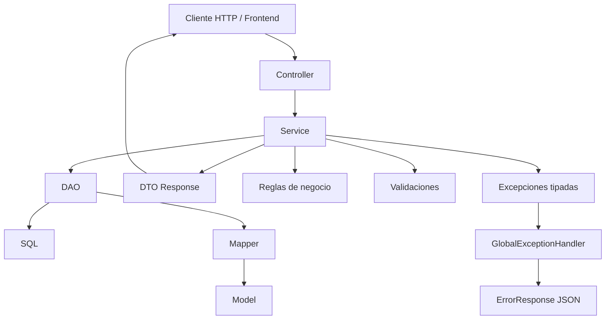
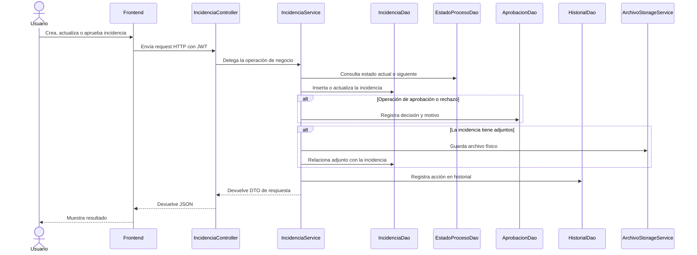

# Diagrama de Clases UML para Exposición

Este documento resume los módulos existentes del backend del sistema de incidencias. El objetivo del diagrama no es mostrar cada método interno, sino explicar de forma clara cómo está organizado el backend y cómo colaboran sus clases principales.

## Diagrama principal de clases

```mermaid
classDiagram
direction LR

namespace auth {
  class AuthController {
    +login(LoginRequest)
    +loginDemo(LoginDemoRequest)
    +me(Authorization)
  }

  class AuthService {
    +login(LoginRequest) AuthResponse
    +loginDemo(LoginDemoRequest) AuthResponse
    +obtenerUsuarioActual(token) UsuarioSesionResponse
  }

  class JwtService {
    +generarToken(Usuario) String
    +validarToken(String) TokenClaims
  }

  class JwtAuthenticationFilter {
    +doFilterInternal()
  }

  class LoginRequest
  class LoginDemoRequest
  class AuthResponse
  class UsuarioSesionResponse
  class TokenClaims
}

namespace usuarios {
  class UsuarioController {
    +listar()
    +obtenerPorId(id)
    +crear(request)
    +actualizar(id, request)
    +cambiarPassword(id, request)
  }

  class RolController {
    +listar()
    +crear(request)
    +actualizar(id, request)
    +eliminar(id)
  }

  class UsuarioService {
    +listar()
    +obtenerPorId(id)
    +crear(request)
    +actualizar(id, request)
  }

  class RolService {
    +listar()
    +crear(request)
    +actualizar(id, request)
    +eliminar(id)
  }

  class PermisoAdministracionService {
    +validarAdministrador(token)
  }

  class UsuarioDao {
    +buscarPorId(id)
    +buscarPorUsername(username)
    +listar()
    +insertar(usuario)
    +actualizar(usuario)
  }

  class RolDao {
    +buscarPorId(id)
    +buscarPorCodigo(codigo)
    +listar()
    +insertar(rol)
    +actualizar(rol)
  }

  class UsuarioMapper
  class UsuarioDtoMapper
  class RolMapper

  class Usuario {
    +UUID id
    +String username
    +String passwordHash
    +String nombres
    +String apellidos
    +String email
    +Boolean activo
  }

  class Rol {
    +UUID id
    +String codigo
    +String nombre
    +String descripcion
    +Boolean activo
  }

  class UsuarioResponse
  class RolResponse
  class CrearUsuarioRequest
  class ActualizarUsuarioRequest
  class CambiarPasswordRequest
}

namespace catalogos {
  class AplicativoClienteController
  class CategoriaController
  class EstadoProcesoController
  class EstadoAprobacionController

  class AplicativoClienteService
  class CategoriaService
  class EstadoProcesoService
  class EstadoAprobacionService

  class AplicativoClienteDao
  class CategoriaDao
  class EstadoProcesoDao
  class EstadoAprobacionDao
  class UsuarioExternoDao

  class AplicativoClienteMapper
  class CategoriaMapper
  class EstadoProcesoMapper
  class EstadoAprobacionMapper
  class UsuarioExternoMapper

  class AplicativoCliente {
    +UUID id
    +String nombre
    +String descripcion
    +String apiKey
    +Boolean activo
  }

  class Categoria {
    +UUID id
    +String nombre
    +String descripcion
    +Boolean activo
  }

  class EstadoProceso {
    +UUID id
    +String codigo
    +String nombre
    +Integer orden
    +Boolean esTerminal
  }

  class EstadoAprobacion {
    +UUID id
    +String codigo
    +String nombre
  }

  class UsuarioExterno {
    +UUID id
    +String nombres
    +String apellidos
    +String email
  }
}

namespace incidencias {
  class IncidenciaController {
    +listar(filtros)
    +obtenerDetalle(id)
    +crear(request)
    +actualizar(id, request)
    +aprobar(id, request)
    +rechazar(id, request)
    +cambiarEstado(id, request)
    +agregarComentario(id, request)
    +agregarAdjunto(id, file)
  }

  class IncidenciaService {
    +listar(filtro, pageRequest)
    +obtenerDetalle(id)
    +crear(request)
    +actualizar(id, request)
    +aprobar(id, request)
    +rechazar(id, request)
    +cambiarEstado(id, request)
    +agregarComentario(id, request)
    +agregarAdjunto(id, request)
  }

  class IncidenciaDao
  class AprobacionDao
  class ComentarioDao
  class AdjuntoDao
  class HistorialIncidenciaDao

  class IncidenciaMapper
  class ComentarioMapper
  class AdjuntoMapper
  class HistorialIncidenciaMapper

  class Incidencia {
    +UUID id
    +String codigo
    +String titulo
    +String descripcion
    +Prioridad prioridad
    +UUID aplicativoId
    +UUID categoriaId
    +UUID estadoProcesoId
    +UUID estadoAprobacionId
  }

  class Aprobacion {
    +UUID id
    +UUID incidenciaId
    +UUID aprobadorId
    +String decision
    +String motivoRechazo
  }

  class Comentario {
    +UUID id
    +UUID incidenciaId
    +UUID usuarioId
    +String contenido
  }

  class Adjunto {
    +UUID id
    +UUID incidenciaId
    +String nombreOriginal
    +String rutaArchivo
    +String tipoMime
  }

  class HistorialIncidencia {
    +UUID id
    +UUID incidenciaId
    +String accion
    +String descripcion
  }

  class Prioridad {
    <<enum>>
    BAJA
    MEDIA
    ALTA
    CRITICA
  }

  class CrearIncidenciaRequest
  class ActualizarIncidenciaRequest
  class CambiarEstadoRequest
  class AprobacionRequest
  class CrearComentarioRequest
  class CrearAdjuntoRequest
  class IncidenciaResponse
  class IncidenciaDetalleResponse
  class ComentarioResponse
  class AdjuntoResponse
  class HistorialResponse
}

namespace shared {
  class SecurityConfig
  class CorsConfig
  class ArchivosConfig

  class GlobalExceptionHandler {
    +handleException()
  }

  class ErrorResponse {
    +fecha
    +estado
    +error
    +mensaje
    +ruta
    +detalles
  }

  class ArchivoStorageService {
    +guardarArchivo(file, incidenciaId)
    +eliminarArchivo(path)
  }

  class ArchivoAlmacenado {
    +String nombreOriginal
    +String nombreGuardado
    +String ruta
    +Long tamanio
  }

  class PageRequest
  class PageResult
}

AuthController --> AuthService
AuthService --> JwtService
JwtAuthenticationFilter --> JwtService
AuthService --> UsuarioDao
AuthResponse --> UsuarioSesionResponse
TokenClaims --> UsuarioSesionResponse

UsuarioController --> UsuarioService
RolController --> RolService
UsuarioService --> UsuarioDao
UsuarioService --> RolDao
UsuarioService --> UsuarioDtoMapper
UsuarioService --> PermisoAdministracionService
RolService --> RolDao
RolService --> RolMapper
UsuarioDao --> UsuarioMapper
RolDao --> RolMapper
Usuario --> Rol

AplicativoClienteController --> AplicativoClienteService
CategoriaController --> CategoriaService
EstadoProcesoController --> EstadoProcesoService
EstadoAprobacionController --> EstadoAprobacionService

AplicativoClienteService --> AplicativoClienteDao
CategoriaService --> CategoriaDao
EstadoProcesoService --> EstadoProcesoDao
EstadoAprobacionService --> EstadoAprobacionDao

AplicativoClienteDao --> AplicativoClienteMapper
CategoriaDao --> CategoriaMapper
EstadoProcesoDao --> EstadoProcesoMapper
EstadoAprobacionDao --> EstadoAprobacionMapper

IncidenciaController --> IncidenciaService
IncidenciaService --> IncidenciaDao
IncidenciaService --> AprobacionDao
IncidenciaService --> ComentarioDao
IncidenciaService --> AdjuntoDao
IncidenciaService --> HistorialIncidenciaDao
IncidenciaService --> EstadoProcesoDao
IncidenciaService --> EstadoAprobacionDao
IncidenciaService --> ArchivoStorageService

IncidenciaDao --> IncidenciaMapper
ComentarioDao --> ComentarioMapper
AdjuntoDao --> AdjuntoMapper
HistorialIncidenciaDao --> HistorialIncidenciaMapper

Incidencia "1" --> "0..*" Comentario
Incidencia "1" --> "0..*" Adjunto
Incidencia "1" --> "0..*" HistorialIncidencia
Incidencia "1" --> "0..*" Aprobacion
Incidencia --> Prioridad
Incidencia --> AplicativoCliente
Incidencia --> Categoria
Incidencia --> EstadoProceso
Incidencia --> EstadoAprobacion

GlobalExceptionHandler --> ErrorResponse
SecurityConfig --> JwtAuthenticationFilter
ArchivosConfig --> ArchivoStorageService
```

## Cómo leer el diagrama

El backend está organizado por módulos funcionales. Cada módulo agrupa las clases que necesita para resolver una parte del sistema:

- `auth`: autenticación, generación y validación de tokens JWT.
- `usuarios`: administración de usuarios, roles y permisos.
- `catalogos`: mantenimiento de aplicativos, categorías y estados.
- `incidencias`: núcleo del sistema; gestiona incidencias, aprobaciones, comentarios, adjuntos e historial.
- `shared`: componentes transversales como seguridad, CORS, excepciones, paginación y almacenamiento de archivos.

La idea más importante es que el backend sigue una separación por capas:

## Explicación de las capas

| Capa | Responsabilidad | Ejemplo |
|---|---|---|
| Controller | Recibe peticiones HTTP y devuelve respuestas JSON. | `IncidenciaController`, `AuthController` |
| Service | Contiene reglas de negocio y coordina varias operaciones. | `IncidenciaService`, `UsuarioService` |
| DAO | Accede a la base de datos usando JDBC. | `IncidenciaDao`, `UsuarioDao` |
| Mapper | Convierte filas de la base de datos en objetos Java. | `IncidenciaMapper`, `RolMapper` |
| Model | Representa entidades internas del dominio. | `Incidencia`, `Usuario`, `Rol` |
| DTO | Define qué datos entran y salen por la API. | `CrearIncidenciaRequest`, `IncidenciaResponse` |
| Shared | Centraliza infraestructura común. | `SecurityConfig`, `GlobalExceptionHandler` |

## Funcionamiento interno del módulo de incidencias

El módulo de incidencias es el más importante porque concentra el flujo principal del sistema.

## Explicación para exposición

Podés explicarlo así:

> El backend está separado por módulos. Cada módulo sigue el mismo patrón: el `Controller` recibe la petición del frontend, el `Service` aplica las reglas de negocio, el `DAO` consulta PostgreSQL mediante JDBC, el `Mapper` transforma los resultados de la base de datos en objetos Java, y finalmente los `DTO` controlan qué información se expone por la API.

Para el caso principal del sistema:

> Cuando un usuario crea o modifica una incidencia, la petición llega a `IncidenciaController`. Este controlador no contiene lógica compleja, solo delega al `IncidenciaService`. El servicio valida reglas como el estado de la incidencia, la aprobación, los comentarios, los adjuntos y el historial. Luego usa distintos DAOs para guardar la información en la base de datos. Finalmente devuelve un DTO para que el frontend pueda mostrar el resultado.

## Puntos clave para recordar

- El sistema no usa JPA ni Hibernate; trabaja con JDBC puro.
- Los DAOs no contienen reglas de negocio; solo acceso a datos.
- Los Services son el centro de la lógica del sistema.
- Los Controllers son la entrada HTTP del backend.
- Los DTOs evitan exponer directamente los modelos internos.
- `IncidenciaService` es la clase más importante porque coordina el flujo principal del proyecto.
- `shared` contiene infraestructura común para todos los módulos.
