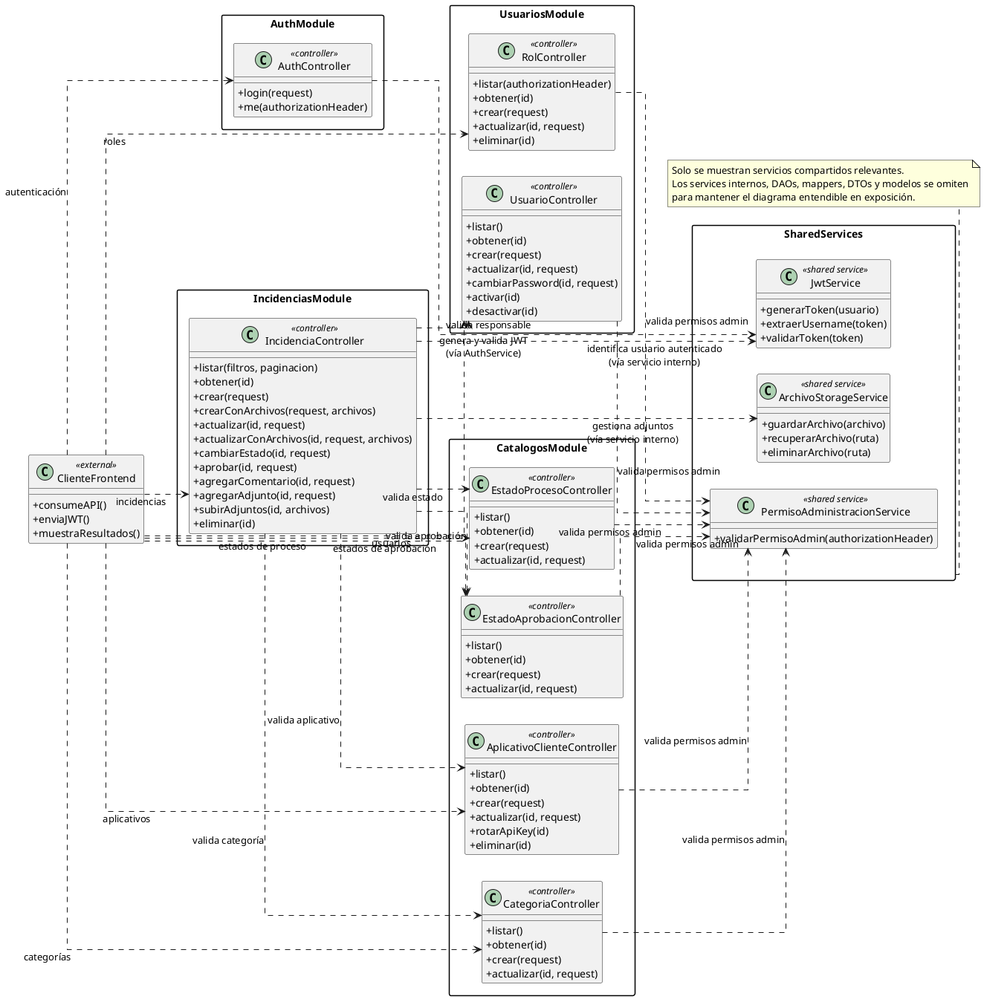
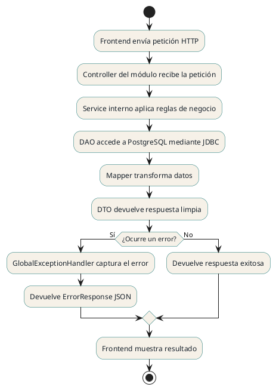
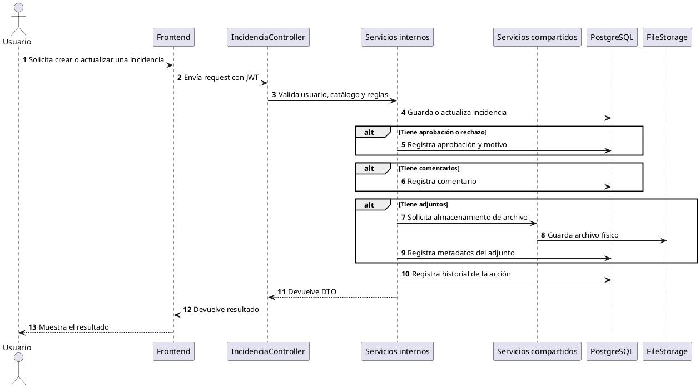

# Diagrama Final Generalizado del Backend

Este diagrama está pensado para exposición. A diferencia de un diagrama técnico completo, no muestra cada `Controller`, `Service`, `DAO` o `Mapper` por separado. En su lugar, agrupa esas clases dentro de módulos generales para que se entienda la arquitectura completa sin saturar la presentación.

## Diagrama UML generalizado en PlantUML

## Cómo leer el diagrama

El diagrama se lee de izquierda a derecha:

1. **`ClienteFrontend`** representa la aplicación web que consume los endpoints del backend.
2. Cada recuadro representa un módulo del backend: autenticación, usuarios, catálogos, incidencias y servicios compartidos.
3. Dentro de cada módulo solo muestro los **controladores** y sus métodos principales.
4. No incluyo modelos, DAOs, mappers, DTOs ni servicios internos porque harían el diagrama demasiado grande para una exposición.
5. En `SharedServices` solo dejo los servicios transversales que realmente ayudan a entender el sistema: JWT, permisos administrativos y almacenamiento de archivos.

## Notaciones UML usadas en el diagrama

| Notación | Nombre | Cómo la explico en la exposición |
|---|---|---|
| `..>` | Dependencia | La uso para indicar que una clase necesita apoyarse en otra para completar una operación. Por ejemplo, los controladores administrativos dependen de `PermisoAdministracionService` para validar permisos. |
| `package` | Agrupación por módulo | La uso para encerrar los controladores dentro del módulo al que pertenecen. No representa herencia; solo ordena visualmente la arquitectura. |
| `<<controller>>` | Estereotipo | Lo uso para dejar claro que esas clases son puntos de entrada HTTP del backend. |
| `<<shared service>>` | Estereotipo | Lo uso para marcar servicios compartidos usados por varios módulos o por operaciones transversales. |

## Explicación general del sistema

El backend está organizado por módulos funcionales. Para la exposición, el diagrama se enfoca en los controladores porque son la puerta de entrada de la API.

| Módulo | Controladores o servicios mostrados | Responsabilidad principal |
|---|---|---|
| `AuthModule` | `AuthController` | Recibe las peticiones de login y consulta del usuario autenticado. |
| `UsuariosModule` | `UsuarioController`, `RolController` | Expone operaciones para administrar usuarios, roles, contraseñas, activación y desactivación. |
| `CatalogosModule` | `AplicativoClienteController`, `CategoriaController`, `EstadoProcesoController`, `EstadoAprobacionController` | Expone los datos base que usa el sistema para clasificar y procesar incidencias. |
| `IncidenciasModule` | `IncidenciaController` | Expone el flujo principal: crear, actualizar, cambiar estado, aprobar, comentar y adjuntar archivos. |
| `SharedServices` | `JwtService`, `PermisoAdministracionService`, `ArchivoStorageService` | Centraliza autenticación por token, validación de permisos administrativos y almacenamiento de adjuntos. |

## Texto sugerido para exposición sobre relaciones UML

Podés explicarlo así, en primera persona:

> En este diagrama estoy mostrando el backend desde sus controladores, porque los controladores son la entrada real de las peticiones HTTP. Por eso no incluyo modelos, DAOs, mappers ni DTOs: existen en el proyecto, pero para esta exposición harían el diagrama más pesado.

> Cada recuadro representa un módulo. En autenticación tengo `AuthController`; en usuarios tengo `UsuarioController` y `RolController`; en catálogos tengo los controladores de aplicativos, categorías y estados; y en incidencias tengo `IncidenciaController`, que concentra el flujo principal del sistema.

> Las flechas punteadas representan dependencias. Por ejemplo, varios controladores dependen de `PermisoAdministracionService` para validar que el usuario tenga permisos de administración antes de crear, actualizar o eliminar información.

> También muestro `JwtService` porque es importante para entender la autenticación. El login genera un token JWT y luego ese token permite identificar al usuario cuando consume endpoints protegidos.

> Finalmente, incluyo `ArchivoStorageService` porque las incidencias pueden manejar adjuntos. En ese caso, el controlador de incidencias recibe la petición y el almacenamiento físico queda delegado a este servicio compartido.

## Flujo interno simplificado

## Flujo principal de incidencias

## Texto sugerido para exposición

Podés explicarlo así:

> Este diagrama muestra el backend de forma generalizada. No se muestran todas las clases técnicas porque eso haría el diagrama muy grande. En su lugar, se agrupan las clases por módulos funcionales.

> El sistema tiene cuatro módulos principales: autenticación, usuarios, catálogos e incidencias. El módulo de autenticación valida al usuario y genera el token JWT. El módulo de usuarios administra usuarios y roles. El módulo de catálogos mantiene datos base como aplicativos, categorías y estados. Finalmente, el módulo de incidencias es el núcleo del sistema, porque maneja la creación, aprobación, rechazo, cambio de estado, comentarios, adjuntos e historial de cada incidencia.

> Internamente, cada módulo sigue una estructura por capas: el controlador recibe la petición, el servicio aplica las reglas de negocio, el DAO accede a PostgreSQL mediante JDBC, el mapper transforma los datos y los DTOs devuelven una respuesta limpia al frontend.

> La infraestructura compartida permite que todos los módulos usen la misma configuración de seguridad, manejo de errores, CORS, paginación y almacenamiento de archivos.

## Puntos clave para recordar

- El diagrama está generalizado para exposición.
- Cada módulo agrupa varias clases internas.
- El módulo más importante es `IncidenciasModule`.
- `IncidenciasModule` depende de usuarios, catálogos, base de datos e infraestructura compartida.
- PostgreSQL almacena los datos principales.
- Los archivos adjuntos se guardan físicamente y solo sus metadatos quedan registrados en la base de datos.
- El backend trabaja con JDBC puro, no con JPA ni Hibernate.
