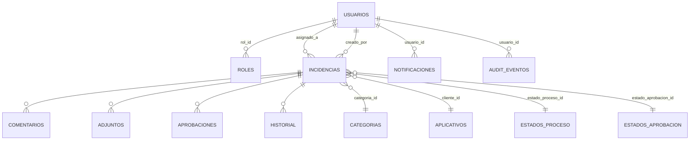
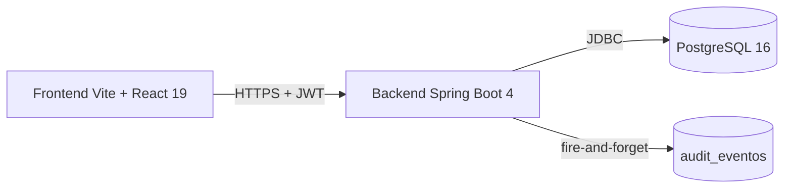

# 📄 PROMPT PARA GENERAR INFORME TÉCNICO

> **Audiencia**: otra IA (Claude, GPT-4, Gemini, etc.) a la que se le va a pedir
> que genere un informe técnico del proyecto **sistema-incidencias** en formato
> **Word (.docx)** o **PDF**.
>
> **Modo de uso**: copia este archivo completo y dáselo a la IA con la
> instrucción:
>
> > *"Lee el archivo `INFORME_PROMPT.md` en la raíz del proyecto
> > `sistema-incidencias` y genera el informe siguiendo esa guía exacta.
> > No modifiques código fuente — solo produce el documento."*

---

## 1. Contexto del proyecto

**Nombre**: `sistema-incidencias` — backoffice de un Sistema de Gestión de Incidencias (tickets).

**Stack**:
- **Backend**: Spring Boot **4.0.6** + Java **22** + PostgreSQL 16. JUnit 5 + Mockito + Apache POI (Excel) + Apache PDFBox (PDF).
- **Frontend**: Vite + React 19 + TypeScript + TanStack Router + Zustand + Tailwind v4 + shadcn/ui (Radix). Node 22.
- **Auth**: JWT HS256 con expiración 2h, BCrypt para passwords.

**Roles canónicos** (en `sistemaincidencias/AGENTS.md`): `ADMINISTRADOR`, `AGENTE`, `USUARIO`.

**Propósito**: backoffice para que una empresa gestione tickets de soporte. Incluye:
- Incidencias (CRUD + workflow de aprobación + workflow de proceso).
- Notificaciones (centro + badge + marcar como leída).
- Reportes exportables a PDF/Excel.
- Dashboard con KPIs y gráficos.
- Panel admin de catálogos (clientes, categorías, estados).
- Perfil de usuario + cambio de password.
- Auditoría global de eventos (login, cambios, etc.).

---

## 2. Archivos a explorar (READ-ONLY, en este orden)

| # | Path | Qué contiene |
|---|---|---|
| 1 | `docs/requerimientos.md` | Los 75 RFs/RNFs originales |
| 2 | `docs/casos_prueba.md` | **63 casos de prueba** con mapeo a tests JUnit (52 ✅, 11 🟡 E2E pendiente) |
| 3 | `docs/https-setup.md` | Setup de HTTPS (perfil `https`, cert autofirmado) |
| 4 | `docs/analisis_uml_planeacion.md` | Análisis histórico del proyecto |
| 5 | `docs/arquitectura_paquetes_backend.md` | Arquitectura de paquetes backend |
| 6 | `docs/esquemas_ddl_remotos.md` | Esquemas DDL referenciados |
| 7 | `docs/reglas_patrones_backend.md` | Reglas del DAO pattern (sin JPA, SQL nativo, etc.) |
| 8 | `sistemaincidencias/AGENTS.md` | Reglas de arquitectura backend (OBLIGATORIO leer) |
| 9 | `sistemaincidencias/src/main/resources/db/scripts/*.sql` | DDL real: 001_auth_base, 002_usuarios_roles_seed, 003_catalogos, 004_incidencias_relaciones, **005_audit_eventos** |
| 10 | `sistemaincidencias/src/main/java/com/integrador/sistemaincidencias/auth/` | AuthController, AuthService, JwtService |
| 11 | `sistemaincidencias/src/main/java/com/integrador/sistemaincidencias/incidencias/` | IncidenciaController + IncidenciaService (RBAC `validarAlcance`) + DAOs |
| 12 | `sistemaincidencias/src/main/java/com/integrador/sistemaincidencias/notificaciones/`, `reportes/`, `dashboard/`, `usuarios/`, `catalogos/`, `auditoria/` | Services + Controllers + DAOs de cada módulo |
| 13 | `sistemaincidencias/src/main/java/com/integrador/sistemaincidencias/shared/pagination/` | `PageRequest`, `PageResult` |
| 14 | `sistemaincidencias/src/test/java/...` | 8 archivos de tests JUnit + Mockito |
| 15 | `frontend/src/lib/http.ts` | Cliente HTTP (Bearer auth, base URL desde env) |
| 16 | `frontend/src/types/auth.ts` | Shape de `AuthUser` (id, email, rol) |
| 17 | `frontend/src/layout/app-sidebar.tsx` | Filtro de items por rol + colapsable |
| 18 | `frontend/src/layout/app-header.tsx` | Toggle mobile/desktop + bell + breadcrumb |
| 19 | `frontend/src/router.tsx` | Definición de rutas + guard `requireAdmin` |
| 20 | `openspec/changes/archive/<cambio>/archive-report.md` | Qué se construyó en cada SDD A-F |
| 21 | `openspec/specs/<modulo>/spec.md` | Capability baselines post-SDD |
| 22 | `sistemaincidencias/src/test/java/com/integrador/sistemaincidencias/incidencias/service/IncidenciaServiceTest.java` | RBAC tests — leer para entender qué cubre |

---

## 3. Secciones del informe (estructura sugerida)

> El informe debe tener **14 secciones** (3.1 a 3.14) con la siguiente
> estructura. Cada sección indica qué incluir, qué formato usar y qué
> fuentes consultar.

### 3.1 Portada
- Título: "Sistema de Gestión de Incidencias — Informe técnico"
- Subtítulo: "Versión 1.0"
- Línea: "Generado el &lt;fecha&gt;"
- Pequeña tabla con metadatos (proyecto, módulo, autor, etc.)
- Tabla de contenidos autogenerada por Word

### 3.2 Resumen ejecutivo
**Máximo 1 página**. Cubre:
- Problema resuelto (backoffice de tickets con RBAC)
- Stack en 1 línea (Spring Boot 4 + React 19 + PostgreSQL)
- Tamaño del proyecto (contar: `controllers=7`, `services=11+`, `tests=60`, `RFs=50/50`, `RNFs=14/25`)
- Métricas concretas (líneas de código, módulos, endpoints)

### 3.3 Arquitectura del sistema
Diagrama de 3 capas en **Mermaid** o ASCII:
```
Frontend (Vite + React 19)  ←→  Backend (Spring Boot 4 + Java 22)  ←→  PostgreSQL 16
                                       ↑
                                  Tests JUnit 5 + Mockito
```

Anotar:
- 7 controllers REST, 1 por módulo
- 11+ services con RBAC inyectado
- JwtAuthenticationFilter custom
- Hikari connection pool

### 3.4 Stack tecnológico
**Tabla markdown** con columnas: capa | tecnología | versión | rol. Ejemplo:

| Capa | Tecnología | Versión | Rol |
|---|---|---|---|
| Backend | Spring Boot | 4.0.6 | Framework + DI + REST |
| Backend | Java | 22 | Lenguaje |
| DB | PostgreSQL | 16 | Persistencia |
| Backend | Apache PDFBox | 3.0.3 | Export PDF |
| Backend | Apache POI | 5.3.0 | Export XLSX |
| Backend | springdoc-openapi | 3.0.0 | Swagger UI (RNF-18) |
| Frontend | Vite | (actual) | Build + dev server |
| Frontend | React | 19 | UI |
| Frontend | Tailwind | v4 | Estilos |
| Tests | JUnit 5 | (actual) | Backend unit tests |
| Tests | Mockito | (actual) | Mocks de DAOs |

### 3.5 Modelo de datos (DER)
**Diagrama Mermaid `erDiagram`** con todas las tablas (extraídas de
`db/scripts/001..005`):

```
usuarios / roles / aplicativos_cliente / categorias
estados_aprobacion / estados_proceso
incidencias (con FKs a cliente, categoria, estado_aprob, estado_proc, asignado_a, creado_por)
comentarios / adjuntos / aprobaciones / historial_incidencias
notificaciones / audit_eventos
```

Para cada tabla incluir:
- Nombre
- PK
- FKs con la tabla referenciada
- Índices relevantes (mencionados en `004_incidencias_relaciones.sql`)

Después del diagrama, agregar **reglas de negocio** (de la lógica del
servicio y de `AGENTS.md`):
- Una incidencia es **SOLICITADA** al crearse
- Solo ADMIN puede cambiar a APROBADA/RECHAZADA
- AGENTE no puede retroceder de estado_proceso
- AGENTE puede SALTAR estados (PENDIENTE → FINALIZADA en un click)
- Soft delete en `usuarios` (campo `activo`)

### 3.6 Capa de controllers (API REST)
**Tabla grande** con todos los endpoints. Agrupar por módulo. Para
cada endpoint:

| Método | Ruta | Roles permitidos | Body | Response |
|---|---|---|---|---|
| POST | `/api/auth/login` | any | `LoginRequest` | `AuthResponse` (token + user) |
| POST | `/api/auth/demo` | any | — | `AuthResponse` (cuenta demo seed) |
| GET | `/api/auth/me` | any | — | `AuthUser` |
| GET | `/api/incidencias` | any | query: `page,size,texto,rol,estado,activo,cliente,asignado` | `PageResult<IncidenciaResponse>` |
| GET | `/api/incidencias/{id}` | any (con scope RBAC) | — | `IncidenciaDetalleResponse` |
| POST | `/api/incidencias` | any | `CrearIncidenciaRequest` | `IncidenciaResponse` (201) |
| PUT | `/api/incidencias/{id}` | ADMIN/AGENTE/owner | `ActualizarIncidenciaRequest` | `IncidenciaResponse` |
| PATCH | `/api/incidencias/{id}/estado` | ADMIN o AGENTE asignado | `{estadoProcesoId, nota}` | `IncidenciaResponse` |
| PATCH | `/api/incidencias/{id}/aprobacion?accion=aprobar\|rechazar` | **ADMIN only** | `{motivoRechazo?}` (rechazar) | `IncidenciaResponse` |
| DELETE | `/api/incidencias/{id}` | **ADMIN only** | — | 204 |
| POST | `/api/incidencias/{id}/comentarios` | ADMIN/AGENTE asignado/owner | `CrearComentarioRequest` | `ComentarioResponse` (201) |
| POST | `/api/incidencias/{id}/adjuntos` | (idem comentarios) | multipart `archivo` | `List<AdjuntoResponse>` (201) |
| GET | `/api/dashboard?rango=7d\|30d\|90d\|all` | any (scope RBAC) | — | `DashboardResponse` |
| GET | `/api/notificaciones` | any | `page,size,soloNoLeidas` | `PageResult<NotificacionResponse>` |
| GET | `/api/notificaciones/no-leidas/count` | any | — | `{total: N}` |
| PATCH | `/api/notificaciones/{id}/leida` | any (owner) | — | 200 |
| POST | `/api/notificaciones/marcar-todas-leidas` | any | — | `{actualizadas: N}` |
| DELETE | `/api/notificaciones/{id}` | any (owner) | — | 204 |
| GET | `/api/reportes?desde=&hasta=&agenteId=&formato=json` | any (scope RBAC) | — | `ReporteResponse` |
| GET | `/api/reportes/exportar?formato=pdf\|xlsx` | any | — | binary download |
| GET | `/api/usuarios` | **ADMIN only** | `page,size,texto,rol,activo` | `PageResult<UsuarioResponse>` |
| POST | `/api/usuarios` | **ADMIN only** | `CrearUsuarioRequest` | `UsuarioResponse` (201) |
| PATCH | `/api/usuarios/{id}/activar\|desactivar` | **ADMIN only** | — | `UsuarioResponse` |
| DELETE | `/api/usuarios/{id}` | **ADMIN only** | — | 204 |
| GET | `/api/usuarios/me` | any | — | `UsuarioResponse` |
| PUT | `/api/usuarios/me` | any | `ActualizarPerfilRequest` | `UsuarioResponse` |
| PUT | `/api/usuarios/me/password` | any | `CambiarPasswordPropiaRequest` | 204 |
| GET | `/api/categorias` | any | — | `List<CategoriaResponse>` |
| POST | `/api/categorias` | **ADMIN only** | `CategoriaRequest` | 201 |
| DELETE | `/api/categorias/{id}` | **ADMIN only** | — | 204 |
| (mismo patrón para) | `/api/aplicativos` | — | — | — |
| (mismo patrón para) | `/api/estados-proceso` | — | — | — |
| (mismo patrón para) | `/api/estados-aprobacion` | — | — | — |

**Total**: ~30 endpoints, 7 controllers, 7 módulos.

Después de la tabla, una **sección sobre RBAC en controllers**:
- Cada controller llama `permisoAdministracionService.validarAdministrador(token)` o `validarAutenticado(token)` antes de delegar al service.
- `IncidenciaController.listar` además inyecta `asignadoA`/`creadoPorUsuarioId` en el filtro según rol.
- AGENTE no ve la Card de "Cambiar estado de aprobación" en el frontend (controlado en `incidencia-sidebar.tsx`); el backend también rechaza con 403 vía `validarAlcance`.

### 3.7 Capa de servicios
- Tabla con los **11+ services** y su responsabilidad (1 línea cada uno):
  - `AuthService` — login, loginDemo, sesión, cambio de password self
  - `UsuarioService` — CRUD + perfil + soft delete
  - `IncidenciaService` — CRUD + RBAC por recurso (`validarAlcance`)
  - `NotificacionService` — listar scoped por usuario + marcar leída
  - `ReporteService` — construcción + export PDF/XLSX
  - `DashboardService` — KPIs + gráficos con scope por rol
  - `CategoriaService` / `AplicativoClienteService` / `EstadoProcesoService` / `EstadoAprobacionService` — CRUD admin-only
  - `PermisoAdministracionService` — gate transversal (validarAdmin/validarAutenticado)
  - `AuditService` — fire-and-forget log global (RNF-09)
- Detalle de `IncidenciaService.validarAlcance` (privado) — **4 acciones permitidas por rol**:

| Acción | ADMIN | AGENTE (asignado) | USUARIO (creador) |
|---|:---:|:---:|:---:|
| `obtener` (detalle) | ✅ cualquiera | ✅ si asignado | ✅ si propio |
| `actualizar` | ✅ | ✅ si asignado | ❌ |
| `cambiarEstado` (proceso) | ✅ | ✅ si asignado | ❌ |
| `aprobar` / `rechazar` | ✅ | ❌ | ❌ |
| `eliminar` | ✅ | ❌ | ❌ |
| `agregarComentario` / `agregarAdjunto` | ✅ | ✅ si asignado | ✅ si propio |

### 3.8 Capa frontend (interfaces)
Para cada pantalla principal, descripción de qué muestra + opcional
diagrama ASCII del layout. Capturas NO son necesarias; basta con
descripción textual + rutas en el código que las implementan.

| Pantalla | Ruta | Componente principal | Notas |
|---|---|---|---|
| Login | `/` (index) | `pages/login` | Botón "Acceso demo" además de credenciales |
| Dashboard | `/dashboard` | `pages/dashboard` | 5 KPI cards + 2 charts + actividad + recientes |
| Incidencias (lista) | `/incidencias` | `pages/incidencias` | Tabla paginada + filtros (búsqueda, estados, prioridad, etc.) |
| Incidencias (detalle) | `/incidencias/:id` | `pages/incidencias/detalle` | Sidebar colapsable + tabs comentarios/adjuntos/actividad |
| Notificaciones (centro) | `/notificaciones` | `pages/notificaciones` | Lista paginada + marcar leída + marcar todas |
| Reportes | `/reportes` | `pages/reportes` | Filtros + export PDF/XLSX |
| Configuración | `/configuracion` | `pages/configuracion` | 4 tabs (categorías, aplicativos, estados) — admin-only |
| Perfil | `/perfil` | `pages/perfil` | 3 tabs (info, password, danger zone) |

Mencionar:
- **RF-48 responsive**: sidebar collapsable (w-64 / w-16), drawer mobile (<768px).
- **RF-46 breadcrumb**: trail `Inicio > <Sección>` en el topbar.
- **Notificaciones en tiempo casi-real**: polling 30s (RF-37 — strict SSE es follow-up).

### 3.9 RBAC (roles y permisos)
**Tabla matricial** de capacidades por rol. Resumir `validarAlcance` y
las decisiones de sanitización del detalle (cliente/categoría/solicitante/
responsable/estadoAprob en null para no-admin).

Incluir:
- ADMINISTRADOR: ve todo, opera todo, gestiona usuarios + catálogos.
- AGENTE: ve solo las asignadas; cambia estado de proceso; **no** cambia aprobación; **no** ve cliente/categoría/solicitante/responsable.
- USUARIO: ve solo las que creó; comenta/adjunta; **no** edita/elimina/cambia estado; **no** ve detalle ajeno (403 + redirect).

### 3.10 Casos de prueba
- Resumen de `docs/casos_prueba.md`: **63 CPs** totales, **52 ✅ pasando**, **11 🟡 E2E pendiente** (requeriría `@SpringBootTest` + Testcontainers).
- Tabla por módulo: Auth (5), Usuarios (8), Incidencias (12), Notificaciones (7), Reportes (5), Dashboard (5), Auditoría (5), Paginación (5).
- Mencionar que el doc original tenía datos erróneos (UUIDs `550e8400-...` fake, email `admin@empresa.com`, rol `GESTOR_APROBACIÓN` inexistente) y se corrigió este turno.

### 3.11 Tests automatizados
- **60 tests JUnit + Mockito**, 0 failures, ~4.4s de ejecución.
- Listar los 8 archivos de test y qué cubren (ver `docs/casos_prueba.md`).
- Diagrama: qué capas están testeadas (services + utilities) y cuáles NO (DAOs reales, controllers, frontend).

### 3.12 Seguridad
- **bcrypt** para passwords (Spring Security PasswordEncoder).
- **JWT HS256** con expiración 2h, firmado con secreto en `application.properties`.
- **JwtAuthenticationFilter** custom (no usa `oauth2ResourceServer`).
- **PermisoAdministracionService** transversal: `validarAdministrador` (lanza 403 si no admin) + `validarAutenticado` (cualquier rol logueado).
- **IncidenciaService.validarAlcance** (privado): RBAC por recurso, no por endpoint.
- **Sanitización del detalle** (`obtenerDetalle`): para no-admin, `clienteId`/`categoriaId`/`creadoPorUsuarioId`/`asignadoA`/`estadoAprobacionId` se setean a null.
- **HTTPS opt-in** via perfil `https` con cert autofirmado (PKCS12, 365 días, password `changeit`).
- **Audit log global** (RNF-09) cross-módulo: 16 acciones cubiertas (LOGIN, USER_CREATED, CATALOG_UPDATED, etc.).
- **Fire-and-forget** del audit: si el insert falla, WARN loggeado; **no** propaga exception → la operación de negocio sigue.

### 3.13 Despliegue y entorno
- **Dev backend**: `./mvnw spring-boot:run` (puerto 8080, sin HTTPS)
- **Dev backend con HTTPS**: `SPRING_PROFILES_ACTIVE=https ./mvnw spring-boot:run` (puerto 8443)
- **Dev frontend**: `npm run dev` (puerto 5173, Vite HMR)
- **DB local**: PostgreSQL 16 con seeds en `db/scripts/001..005`
- **Tests**: `./mvnw test` (60 tests, ~4.4s)
- **Swagger UI**: `http://localhost:8080/swagger-ui.html` (RNF-18)
- **Logs**: `sistemaincidencias/logs/sistemaincidencias.log` (rotativo via logback)
- **Producción** (recomendaciones, no implementado):
  - Reverse proxy nginx con Let's Encrypt
  - Load balancer horizontal
  - PostgreSQL gestionado (RDS / Cloud SQL)
  - Monitoring (Prometheus + Grafana)

### 3.14 Trabajo futuro / pendientes
**Lo que falta** organizado por prioridad:

1. **E2E completos** con `@SpringBootTest` + Testcontainers (PostgreSQL) → CRUD real via MockMvc.
2. **WebMvcTest** de controllers → cubre el scope-injection que vive en `IncidenciaController.listar` (no testeado por unit tests).
3. **Tests de DAOs** con H2 en memoria → validan SQL.
4. **Tests de exporters** (PDFBox/POI) con fixtures.
5. **RNF-15 WCAG audit** con axe-core.
6. **RNF-21 perf benchmark** con k6/wrk + SLOs.
7. **RNF-24 cross-browser** matrix (Chrome/FF/Safari/Edge).
8. **SSE para notificaciones** reales (reemplazar polling 30s).
9. **RNF-09 — endpoint `GET /api/audit-eventos`** admin-only para visualizar el log desde el frontend.
10. **RNF-09 — correr migración 005** en BD dev (script `db/scripts/005_audit_eventos.sql`).

---

## 4. Formato y estilo del output

- **Tipo de archivo**: `.docx` (preferido) o `.pdf`. Recomiendo generar primero
  un **Markdown estructurado** y luego convertir con `pandoc`.
- **Tipografía**: usar estilos consistentes; headings con jerarquía clara
  (H1, H2, H3 con tamaños diferentes).
- **Código**: bloques con syntax highlighting; identificadores en
  monospace.
- **Diagramas**: **Mermaid** (puede renderizarse con mermaid-cli o
  pastear en mermaid.live para verificar).
- **Tablas**: en cada sección que aplique. Evitar párrafos cuando una
  tabla comunica mejor.
- **Longitud objetivo**: 25-40 páginas A4 con la información completa.
- **Tono**: técnico y factual. **Cero marketing**, cero superlativos.
- **Cifras exactas**: verificar contra `mvn test`, no inventar números.
- **Datos sensibles**: NO incluir passwords en texto plano (usar "admin123"
  como placeholder marcado como seed dev).

### Plantilla sugerida de diagramas Mermaid

Para el DER (sección 3.5):


Para arquitectura (sección 3.3):


---

## 5. Herramientas recomendadas para la IA

| Formato | Herramienta | Por qué |
|---|---|---|
| Word | Python `python-docx` | Control fino de estilos, tablas, headers |
| PDF (desde MD) | `pandoc INFORME.md -o informe.pdf` | Lo más simple si tienes pandoc |
| PDF (control fino) | Python `reportlab` | Si necesitas gráficos vectoriales complejos |
| Conversión docx→pdf | `libreoffice --headless --convert-to pdf informe.docx` | Para un PDF final rápido |

**Recomendado**: generar el contenido en Markdown estructurado (lo lee
mejor la IA), convertir a docx con pandoc, luego opcionalmente a pdf.

---

## 6. Restricciones importantes

1. **READ-ONLY**: este prompt es solo para generar el informe. **No** modifiques
   código fuente. La IA que ejecute este prompt no debe commitear nada.
2. **Cifras exactas**: cuando el doc diga "60 tests" o "75 RFs", verificar
   corriendo `mvn test` y leyendo el código. No inventar números.
3. **Nombres de clase/método exactos**: usar los del código (ej.
   `IncidenciaService.validarAlcance`, no "el validador de alcance").
4. **Tono profesional**: cero marketing. Si no encontrás info, decir
   "no encontrado en el código actual" en lugar de inventar.
5. **Cero cambios a archivos**: el output es el informe (.docx/.pdf) y
   opcionalmente un `.md` fuente. No tocar `sistemaincidencias/**`,
   `frontend/**`, ni `docs/**` salvo para crear el `.md` fuente del informe.

---

## 7. Checklist de verificación post-generación

Después de que la IA genere el informe, verificar:

- [ ] Las 14 secciones (3.1-3.14) están presentes
- [ ] Los diagramas Mermaid compilan (pastearlos en mermaid.live)
- [ ] Las tablas tienen datos correctos (cross-check con `docs/casos_prueba.md`)
- [ ] Los nombres de clases/métodos coinciden con el código
- [ ] Las cifras son exactas (60 tests, 75 RFs, 30 endpoints, 7 controllers, 11 services)
- [ ] No hay passwords reales en el output (sólo placeholders "admin123" marcados como seed)
- [ ] El informe se puede abrir en Word/LibreOffice sin errores

Si la IA no puede generar algo (ej. diagramas muy complejos), que lo
declare como "limitación conocida" en la sección correspondiente, en lugar
de inventar.
