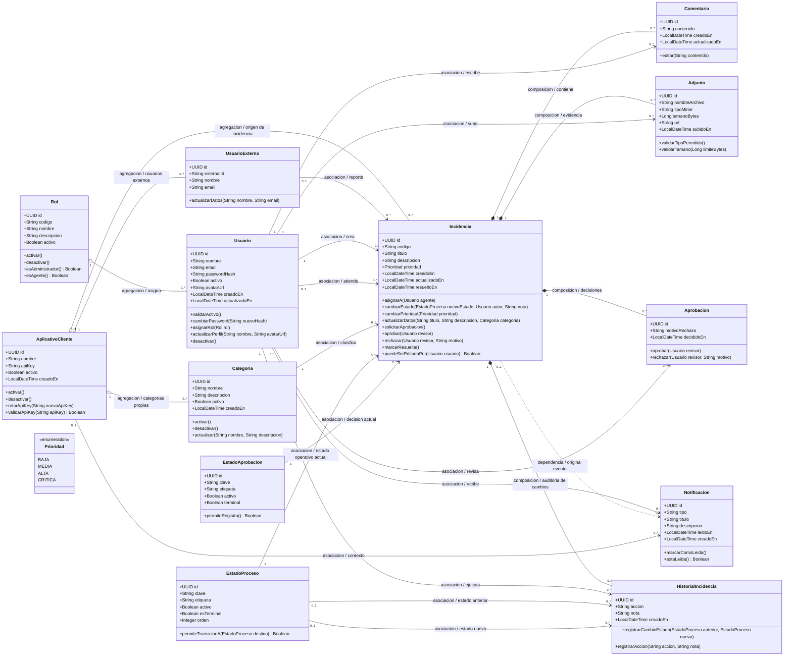
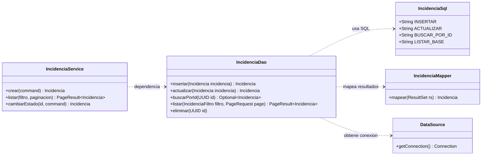
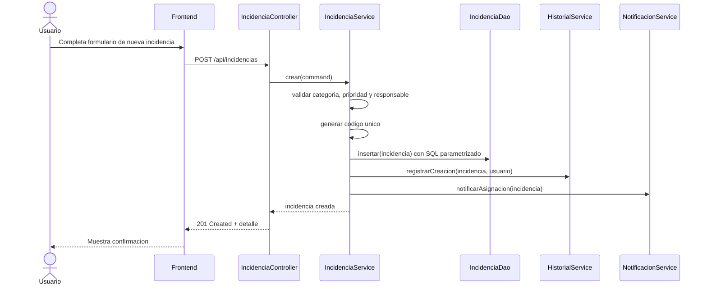
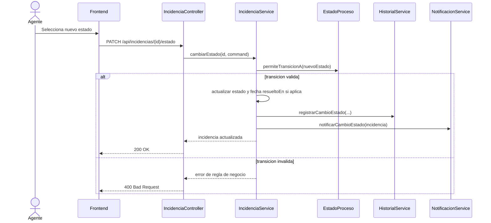
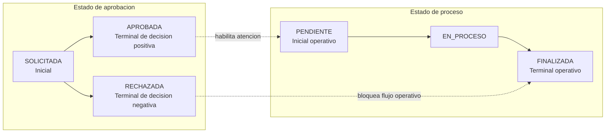

# Sistema de Gestion de Incidencias - Analisis UML y planeacion

Este documento consolida el analisis del DER, requerimientos, casos de uso e interfaces del prototipo para convertir el proyecto a una aplicacion Java Spring Boot.

## 1. Alcance funcional identificado

Actores principales:

- Usuario final: crea incidencias, consulta estado, adjunta evidencias, comenta y cierra/valida resolucion.
- Agente/Gestor: atiende incidencias, cambia estados, comenta, consulta historial, genera reportes y administra categorias segun permisos.
- Administrador: gestiona usuarios, roles, estados, categorias, aplicativos cliente, reportes y configuracion.

Modulos del sistema:

- Autenticacion y control de acceso por roles.
- Dashboard y metricas.
- Gestion de incidencias.
- Comentarios, adjuntos e historial.
- Aprobaciones o rechazo de incidencias.
- Gestion de usuarios, roles, aplicativos cliente y usuarios externos.
- Notificaciones.
- Reportes y exportacion.
- Configuracion de categorias y estados.

## 2. Criterio de relaciones UML utilizado

Para que el diagrama sea claro al exponerlo, se usan estos tipos de relaciones:

| Relacion | Simbolo Mermaid | Significado en este proyecto |
|---|---|---|
| Asociacion | `-->` | Una clase conoce o referencia a otra mediante una llave foranea o atributo. Ejemplo: una incidencia tiene un usuario asignado. |
| Agregacion | `o--` | Relacion todo-parte debil. La parte puede existir aunque el todo se desactive o cambie. Ejemplo: un aplicativo agrupa categorias. |
| Composicion | `*--` | Relacion todo-parte fuerte. La parte depende funcionalmente del todo. Ejemplo: comentarios, adjuntos e historial pertenecen a una incidencia. |
| Dependencia | `..>` | Una clase usa a otra de forma temporal para ejecutar una operacion. Ejemplo: un servicio depende de otro servicio. |

Nota: en base de datos casi todo se implementa con llaves foraneas, pero en UML conviene distinguir la intencion de la relacion. Por eso una FK no siempre se marca igual: puede ser asociacion, agregacion o composicion segun la regla de negocio.

## 3. Modelo de clases de dominio



### 3.1 Detalle de relaciones principales

| Origen | Destino | Tipo UML | Justificacion |
|---|---|---|---|
| `Rol` | `Usuario` | Agregacion | Un rol agrupa usuarios, pero el rol y el usuario tienen ciclo de vida propio. |
| `AplicativoCliente` | `Categoria` | Agregacion | Las categorias pertenecen al aplicativo de origen, pero se administran como catalogo. |
| `AplicativoCliente` | `Incidencia` | Agregacion | El aplicativo identifica de donde viene la incidencia; no reemplaza a la incidencia. |
| `Incidencia` | `Comentario` | Composicion | El comentario solo tiene sentido dentro de una incidencia. |
| `Incidencia` | `Adjunto` | Composicion | El adjunto es evidencia de una incidencia concreta. |
| `Incidencia` | `Aprobacion` | Composicion | Las aprobaciones son decisiones historicas de una incidencia. |
| `Incidencia` | `HistorialIncidencia` | Composicion | El historial existe para auditar una incidencia especifica. |
| `Usuario` | `Incidencia` | Asociacion | El usuario puede crear o atender muchas incidencias, pero no las contiene. |
| `EstadoProceso` | `Incidencia` | Asociacion | La incidencia referencia su estado operativo actual. |
| `EstadoAprobacion` | `Incidencia` | Asociacion | La incidencia referencia su estado de decision actual. |
| `Incidencia` | `Notificacion` | Dependencia | Una accion de la incidencia genera notificaciones, pero no son parte estructural de ella. |

## 4. Clases de aplicacion Spring Boot

```mermaid
classDiagram
direction TB

class AuthController {
  +login(LoginRequest request) AuthResponse
  +demoLogin() AuthResponse
  +me() UsuarioResponse
  +logout() void
}

class IncidenciaController {
  +crear(CrearIncidenciaRequest request) IncidenciaResponse
  +listar(IncidenciaFiltro filtro, Pageable pageable) Page~IncidenciaResumenResponse~
  +obtener(UUID id) IncidenciaDetalleResponse
  +actualizar(UUID id, ActualizarIncidenciaRequest request) IncidenciaResponse
  +cambiarEstado(UUID id, CambiarEstadoRequest request) IncidenciaResponse
  +aprobar(UUID id, AprobarIncidenciaRequest request) IncidenciaResponse
  +rechazar(UUID id, RechazarIncidenciaRequest request) IncidenciaResponse
  +eliminar(UUID id) void
}

class ComentarioController {
  +agregar(UUID incidenciaId, CrearComentarioRequest request) ComentarioResponse
  +listar(UUID incidenciaId) List~ComentarioResponse~
  +editar(UUID id, EditarComentarioRequest request) ComentarioResponse
}

class AdjuntoController {
  +subir(UUID incidenciaId, MultipartFile archivo) AdjuntoResponse
  +listar(UUID incidenciaId) List~AdjuntoResponse~
  +eliminar(UUID id) void
}

class UsuarioController {
  +crear(CrearUsuarioRequest request) UsuarioResponse
  +listar(UsuarioFiltro filtro, Pageable pageable) Page~UsuarioResponse~
  +obtener(UUID id) UsuarioResponse
  +actualizar(UUID id, ActualizarUsuarioRequest request) UsuarioResponse
  +desactivar(UUID id) void
  +eliminar(UUID id) void
}

class CatalogoController {
  +listarCategorias(UUID aplicativoId) List~CategoriaResponse~
  +crearCategoria(CategoriaRequest request) CategoriaResponse
  +actualizarCategoria(UUID id, CategoriaRequest request) CategoriaResponse
  +eliminarCategoria(UUID id) void
  +listarEstados() List~EstadoProcesoResponse~
  +crearEstado(EstadoProcesoRequest request) EstadoProcesoResponse
  +listarEstadosAprobacion() List~EstadoAprobacionResponse~
}

class AplicativoController {
  +crear(AplicativoRequest request) AplicativoResponse
  +listar(Pageable pageable) Page~AplicativoResponse~
  +obtener(UUID id) AplicativoResponse
  +actualizar(UUID id, AplicativoRequest request) AplicativoResponse
  +desactivar(UUID id) void
  +rotarApiKey(UUID id) AplicativoResponse
}

class DashboardController {
  +obtenerKPIs(DashboardFiltro filtro) DashboardResponse
  +incidenciasRecientes() List~IncidenciaResumenResponse~
}

class ReporteController {
  +generar(ReporteFiltro filtro) ReporteResponse
  +exportarExcel(ReporteFiltro filtro) Resource
  +exportarPdf(ReporteFiltro filtro) Resource
}

class NotificacionController {
  +listar() List~NotificacionResponse~
  +contarNoLeidas() Long
  +marcarLeida(UUID id) void
  +marcarTodasLeidas() void
}

class AuthService {
  +login(String email, String password) AuthResponse
  +generarToken(Usuario usuario) String
  +obtenerUsuarioActual() Usuario
}

class IncidenciaService {
  +crear(CrearIncidenciaCommand command) Incidencia
  +buscarPorId(UUID id) Incidencia
  +listar(IncidenciaFiltro filtro, Pageable pageable) Page~Incidencia~
  +actualizar(UUID id, ActualizarIncidenciaCommand command) Incidencia
  +cambiarEstado(UUID id, CambiarEstadoCommand command) Incidencia
  +aprobar(UUID id, AprobarIncidenciaCommand command) Incidencia
  +rechazar(UUID id, RechazarIncidenciaCommand command) Incidencia
  +eliminar(UUID id)
}

class HistorialService {
  +registrarCreacion(Incidencia incidencia, Usuario autor)
  +registrarCambioEstado(Incidencia incidencia, EstadoProceso anterior, EstadoProceso nuevo, Usuario autor, String nota)
  +listarPorIncidencia(UUID incidenciaId) List~HistorialIncidencia~
}

class NotificacionService {
  +notificarAsignacion(Incidencia incidencia)
  +notificarCambioEstado(Incidencia incidencia)
  +notificarComentario(Comentario comentario)
  +marcarComoLeida(UUID id, Usuario usuario)
}

class ReporteService {
  +generarReporte(ReporteFiltro filtro) ReporteData
  +exportarExcel(ReporteData data) byte[]
  +exportarPdf(ReporteData data) byte[]
}

class AplicativoService {
  +crear(AplicativoCommand command) AplicativoCliente
  +listar(Pageable pageable) Page~AplicativoCliente~
  +actualizar(UUID id, AplicativoCommand command) AplicativoCliente
  +desactivar(UUID id)
  +rotarApiKey(UUID id) AplicativoCliente
}

AuthController ..> AuthService : dependencia
IncidenciaController ..> IncidenciaService : dependencia
ComentarioController ..> IncidenciaService : dependencia
AdjuntoController ..> IncidenciaService : dependencia
UsuarioController ..> AuthService : dependencia
DashboardController ..> ReporteService : dependencia
ReporteController ..> ReporteService : dependencia
NotificacionController ..> NotificacionService : dependencia
AplicativoController ..> AplicativoService : dependencia
IncidenciaService ..> HistorialService : dependencia
IncidenciaService ..> NotificacionService : dependencia
ReporteService ..> IncidenciaService : dependencia
```



## 5. Diagrama de paquetes recomendado

```mermaid
flowchart TB
  app["com.integrador.sistemaincidencias"]
  config["config<br/>SecurityConfig, OpenApiConfig, CorsConfig"]
  auth["auth<br/>controller, service, dto, jwt"]
  incidencias["incidencias<br/>controller, service, model, dao, mapper, dto"]
  usuarios["usuarios<br/>controller, service, model, dao, mapper, dto"]
  catalogos["catalogos<br/>categorias, estados, roles"]
  aplicativos["aplicativos<br/>AplicativoCliente, UsuarioExterno"]
  notificaciones["notificaciones<br/>service, model, dao, dto"]
  reportes["reportes<br/>service, dto, exporters"]
  auditoria["auditoria<br/>HistorialIncidencia, AuditLog"]
  shared["shared<br/>exceptions, validation, mapper, response"]

  app --> config
  app --> auth
  app --> incidencias
  app --> usuarios
  app --> catalogos
  app --> aplicativos
  app --> notificaciones
  app --> reportes
  app --> auditoria
  app --> shared
```



### 5.1 Persistencia sin JPA ni Hibernate

La capa de persistencia se implementa manualmente con DAOs. Cada DAO contiene SQL nativo parametrizado y convierte los resultados a modelos Java mediante mappers.



Estructura sugerida para cada modulo:

- `model`: clases POJO del dominio, sin anotaciones ORM.
- `dao`: clases con operaciones SQL.
- `sql`: constantes o constructores de consultas.
- `mapper`: conversion de `ResultSet` a objetos Java.
- `dto`: requests y responses de la API.
- `service`: reglas de negocio, transacciones, validaciones y orquestacion.

## 6. Secuencia: crear incidencia



## 7. Secuencia: cambio de estado



## 8. Flujo recomendado de estados

El modelo mantiene dos estados separados para evitar mezclar decisiones administrativas con avance operativo.



Regla recomendada: al crear una incidencia, se registra con `EstadoAprobacion = SOLICITADA`. Cuando un agente o administrador la aprueba, cambia a `APROBADA` y se inicia o mantiene el `EstadoProceso = PENDIENTE`. Si se rechaza, cambia a `RECHAZADA` y no deberia pasar a `EN_PROCESO`.

## 9. Reglas de negocio clave

- El correo de `Usuario` debe ser unico.
- Un usuario desactivado no puede iniciar sesion.
- La contrasena se almacena cifrada con bcrypt o Argon2.
- La incidencia debe manejar dos dimensiones de estado: `EstadoAprobacion` para la decision de aceptacion/rechazo y `EstadoProceso` para el avance operativo de atencion.
- Los estados iniciales recomendados para aprobacion son `SOLICITADA`, `APROBADA` y `RECHAZADA`. Si el docente exige solo dos decisiones, `APROBADA` y `RECHAZADA` quedan como estados terminales y `SOLICITADA` funciona como estado inicial pendiente de decision.
- Los estados iniciales recomendados para proceso son `PENDIENTE`, `EN_PROCESO` y `FINALIZADA`.
- Las tablas de estados deben permitir personalizacion futura mediante campos como `clave`, `etiqueta`, `orden`, `activo` y `es_terminal`.
- El cambio de `EstadoProceso` debe respetar el orden configurado en `EstadoProceso.orden`.
- Una incidencia rechazada no debe avanzar en el flujo operativo, salvo que se reactive mediante una regla administrativa explicita.
- Si el estado de proceso es terminal, se debe registrar `resueltoEn`.
- Una categoria no debe eliminarse si tiene incidencias asociadas.
- Un rol no debe eliminarse si tiene usuarios asignados.
- Los filtros de incidencias deben soportar texto, estado de aprobacion, estado de proceso, prioridad, categoria, fechas, responsable y aplicativo cliente.
- Toda accion critica debe crear historial o log de auditoria.
- Las notificaciones se generan al asignar incidencia, aprobar/rechazar, cambiar estado de proceso y crear comentario relevante.

## 10. Endpoints base sugeridos

| Modulo | Metodo | Ruta | Uso |
|---|---:|---|---|
| Auth | POST | `/api/auth/login` | Iniciar sesion |
| Auth | GET | `/api/auth/me` | Usuario autenticado |
| Incidencias | POST | `/api/incidencias` | Crear incidencia |
| Incidencias | GET | `/api/incidencias` | Listar con filtros y paginacion |
| Incidencias | GET | `/api/incidencias/{id}` | Ver detalle |
| Incidencias | PUT | `/api/incidencias/{id}` | Editar datos |
| Incidencias | PATCH | `/api/incidencias/{id}/estado` | Cambiar estado |
| Incidencias | PATCH | `/api/incidencias/{id}/aprobacion` | Aprobar o rechazar incidencia |
| Comentarios | POST | `/api/incidencias/{id}/comentarios` | Agregar comentario |
| Adjuntos | POST | `/api/incidencias/{id}/adjuntos` | Subir evidencia |
| Usuarios | GET/POST | `/api/usuarios` | Listar y crear usuarios |
| Usuarios | PUT/PATCH | `/api/usuarios/{id}` | Editar o desactivar |
| Aplicativos | GET/POST | `/api/aplicativos` | Gestionar aplicativos cliente |
| Categorias | GET/POST | `/api/categorias` | Gestionar categorias |
| Estados proceso | GET/POST | `/api/estados-proceso` | Gestionar estados operativos |
| Estados aprobacion | GET/POST | `/api/estados-aprobacion` | Gestionar estados de aprobacion |
| Dashboard | GET | `/api/dashboard` | KPIs y graficos |
| Reportes | GET | `/api/reportes` | Generar reporte |
| Reportes | GET | `/api/reportes/exportar` | Exportar PDF/Excel |
| Notificaciones | GET | `/api/notificaciones` | Centro de notificaciones |

## 11. Planeacion para pasar a codigo

### Fase 1: Base tecnica

- Corregir dependencias del `pom.xml`: Spring Web, Spring Security, Validation, PostgreSQL Driver, Lombok, Google Guava, Apache POI, Apache Commons, Logback y OpenAPI si se permite documentar endpoints.
- No usar Spring Data JPA, JPA ni Hibernate. El acceso a base de datos debe hacerse con SQL nativo parametrizado.
- Configurar perfiles `dev` y `prod`.
- Crear estructura de paquetes por modulo.
- Configurar excepciones globales con `@ControllerAdvice`.
- Configurar Swagger/OpenAPI.
- Configurar `DataSource` y, si el docente lo permite, `JdbcTemplate` de Spring JDBC. Si no lo permite, usar `java.sql.Connection`, `PreparedStatement` y `ResultSet` de forma manual.
- Configurar Logback para registrar errores, auditoria basica y operaciones criticas.

### Fase 2: Persistencia con SQL puro

- Implementar modelos POJO de acuerdo con el DER, sin anotaciones `@Entity`, `@Table`, `@Id` ni relaciones ORM.
- Usar `UUID` como identificador.
- Crear enums para `Prioridad`.
- Crear clases DAO manuales por agregado principal: `UsuarioDao`, `IncidenciaDao`, `CategoriaDao`, `EstadoProcesoDao`, `EstadoAprobacionDao`, `AplicativoDao`, `ComentarioDao`, `AdjuntoDao`, `NotificacionDao` e `HistorialIncidenciaDao`.
- Crear `RowMapper` o metodos privados `mapear(ResultSet rs)` para convertir filas SQL a objetos Java.
- Centralizar las consultas SQL en constantes o clases dedicadas para evitar repetir cadenas en varios metodos.
- Usar consultas parametrizadas con `PreparedStatement` o `JdbcTemplate` para prevenir inyeccion SQL.
- Crear scripts SQL versionados en una carpeta como `src/main/resources/db/scripts` o `database`. Si se permite Flyway o Liquibase solo para ejecutar scripts, puede usarse; si no, documentar y ejecutar los scripts manualmente.
- Insertar datos iniciales: roles, estados de aprobacion (`SOLICITADA`, `APROBADA`, `RECHAZADA`), estados de proceso (`PENDIENTE`, `EN_PROCESO`, `FINALIZADA`) y categorias base por aplicativo.

### Fase 3: Seguridad

- Implementar login con Spring Security.
- Cifrar contrasenas con `PasswordEncoder`.
- Emitir y validar JWT.
- Aplicar RBAC por endpoint con `@PreAuthorize`.
- Bloquear usuarios desactivados.

### Fase 4: Incidencias

- CRUD de incidencias.
- Generacion de codigo unico.
- Filtros, ordenamiento y paginacion con SQL nativo usando `WHERE`, `ORDER BY`, `LIMIT` y `OFFSET`.
- Aprobacion/rechazo de incidencias.
- Cambio de estado operativo con validacion de flujo.
- Historial automatico.
- Comentarios y adjuntos.
- Manejo transaccional en servicios para operaciones que afecten varias tablas, por ejemplo: crear incidencia + historial + notificacion.

### Fase 5: Administracion

- CRUD de usuarios.
- Activacion/desactivacion.
- Gestion de roles basica.
- Gestion de aplicativos cliente para distinguir el origen de las incidencias.
- Gestion de usuarios externos asociados a cada aplicativo cuando las incidencias lleguen desde sistemas externos.
- Gestion de categorias y estados.

### Fase 6: Dashboard, notificaciones y reportes

- KPIs por estado, categoria y prioridad.
- Tendencia temporal de incidencias.
- Incidencias recientes.
- Notificaciones leidas/no leidas.
- Reportes por periodo y agente.
- Exportacion Excel/PDF.
- Usar Apache POI para exportar reportes Excel.
- Usar Apache Commons para utilidades de texto, archivos, validaciones simples y manejo de colecciones donde aporte claridad.
- Usar Google Guava para utilidades de colecciones, cache local simple o validaciones auxiliares si el alcance lo justifica.

### Fase 7: Pruebas y calidad

- Pruebas unitarias para servicios de negocio.
- Pruebas de DAOs con base de datos de prueba o scripts SQL controlados.
- Pruebas de seguridad para roles.
- Pruebas de integracion de endpoints principales.
- Validar paginacion de 20 registros y tiempos de respuesta esperados.

## 12. Orden recomendado de implementacion

1. `Rol`, `Usuario`, autenticacion y JWT.
2. `AplicativoCliente`, `Categoria`, `EstadoProceso`, `EstadoAprobacion`.
3. `Incidencia` con CRUD y filtros.
4. Aprobacion/rechazo con historial.
5. Cambio de estado operativo con historial.
6. Comentarios y adjuntos.
7. Notificaciones.
8. Usuarios, aplicativos, categorias y estados administrativos.
9. Dashboard.
10. Reportes y exportaciones.
11. Endurecimiento de seguridad, validaciones y pruebas.

## 13. Dependencias Maven sugeridas

```xml
<dependency>
  <groupId>org.springframework.boot</groupId>
  <artifactId>spring-boot-starter-webmvc</artifactId>
</dependency>
<dependency>
  <groupId>org.springframework.boot</groupId>
  <artifactId>spring-boot-starter-security</artifactId>
</dependency>
<dependency>
  <groupId>org.springframework.boot</groupId>
  <artifactId>spring-boot-starter-validation</artifactId>
</dependency>
<dependency>
  <groupId>org.springframework.boot</groupId>
  <artifactId>spring-boot-starter-jdbc</artifactId>
</dependency>
<dependency>
  <groupId>org.postgresql</groupId>
  <artifactId>postgresql</artifactId>
  <scope>runtime</scope>
</dependency>
<dependency>
  <groupId>org.projectlombok</groupId>
  <artifactId>lombok</artifactId>
  <optional>true</optional>
</dependency>
<dependency>
  <groupId>com.google.guava</groupId>
  <artifactId>guava</artifactId>
  <version>33.4.8-jre</version>
</dependency>
<dependency>
  <groupId>org.apache.commons</groupId>
  <artifactId>commons-lang3</artifactId>
  <version>3.17.0</version>
</dependency>
<dependency>
  <groupId>commons-io</groupId>
  <artifactId>commons-io</artifactId>
  <version>2.18.0</version>
</dependency>
<dependency>
  <groupId>org.apache.poi</groupId>
  <artifactId>poi-ooxml</artifactId>
  <version>5.3.0</version>
</dependency>
<dependency>
  <groupId>org.springdoc</groupId>
  <artifactId>springdoc-openapi-starter-webmvc-ui</artifactId>
  <version>2.8.6</version>
</dependency>
<dependency>
  <groupId>io.jsonwebtoken</groupId>
  <artifactId>jjwt-api</artifactId>
  <version>0.12.6</version>
</dependency>
```

Nota: `spring-boot-starter-jdbc` no es Spring Data JPA ni Hibernate. Solo facilita `DataSource`, transacciones y `JdbcTemplate`. Si el docente pide trabajar exclusivamente con `java.sql`, se puede retirar esta dependencia y usar directamente el driver PostgreSQL con `Connection`, `PreparedStatement` y `ResultSet`.

## 14. Observaciones para el diseño final

- El DER usa `estado_aprobacion_id` dentro de `incidencias` y tambien una tabla `aprobaciones`. La mejor forma de usarlo es mantener `estado_aprobacion_id` como decision actual de la incidencia y usar `aprobaciones` como historial de revisiones. Asi se puede saber el estado actual rapido y tambien conservar quien aprobo o rechazo, cuando y con que motivo.
- Conviene separar el flujo en dos catalogos. `EstadoAprobacion` debe cubrir la decision de aceptacion de la incidencia: `SOLICITADA`, `APROBADA` y `RECHAZADA`. Si se quiere expresar estrictamente solo dos resultados, `APROBADA` y `RECHAZADA` son los estados terminales, mientras `SOLICITADA` representa el estado inicial antes de decidir.
- `EstadoProceso` debe cubrir el avance de atencion: `PENDIENTE`, `EN_PROCESO` y `FINALIZADA`. Se mantiene como tabla para poder personalizar nombres, orden y estados terminales sin cambiar codigo.
- La tabla `clientes` del DER debe entenderse como `AplicativoCliente`: representa los aplicativos o sistemas de la empresa desde donde se registran incidencias. Esto permite saber el origen, manejar `api_key`, separar usuarios externos y tener categorias diferentes por aplicativo.
- Las categorias deben depender del aplicativo cliente. Por ejemplo, el aplicativo de Mesa de Ayuda puede tener categorias distintas al aplicativo de Ventas o RRHH.
- Como el docente pidio no usar Spring Data, JPA ni Hibernate, no corresponde usar JPQL. JPQL depende de entidades JPA y de un proveedor ORM. Para este proyecto se deben usar consultas SQL nativas contra las tablas reales del DER.
- La mejor practica para este contexto es dejar los modelos como POJOs simples y mover la logica compleja a servicios: permisos, transiciones validas, notificaciones, reportes, validacion de adjuntos y generacion de historial. Los DAOs deben limitarse a ejecutar SQL y mapear resultados.
- Lombok se recomienda en modelos, DTOs y clases de respuesta para reducir getters, setters, constructores y builders.
- Google Guava puede usarse para utilidades de colecciones, validaciones auxiliares y cache local simple de catalogos de baja variacion, como roles o estados.
- Apache POI debe usarse para la exportacion de reportes Excel.
- Apache Commons puede apoyar validacion y manejo de cadenas, archivos, extensiones y nombres seguros de adjuntos.
- Logback debe configurarse para registrar errores, intentos de login, cambios de estado, aprobaciones/rechazos y operaciones administrativas relevantes.
