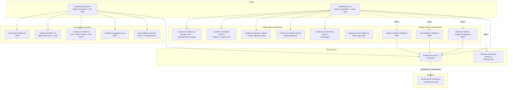
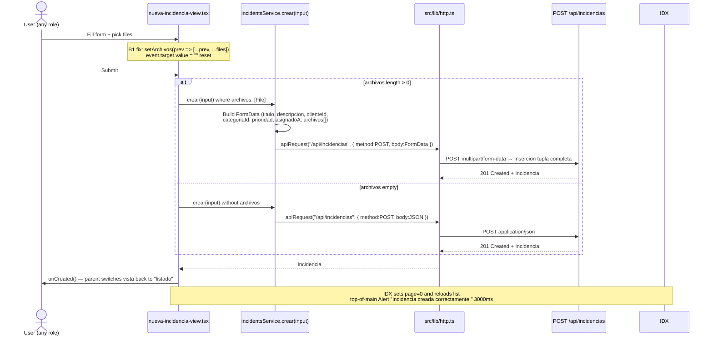
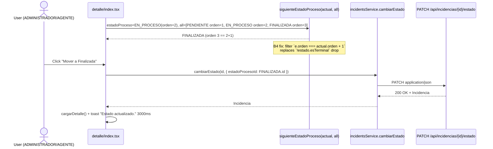
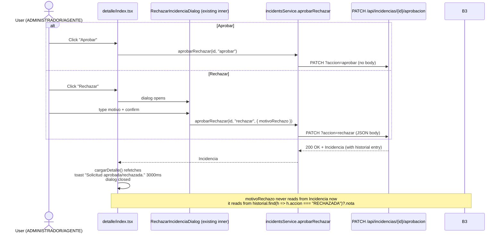
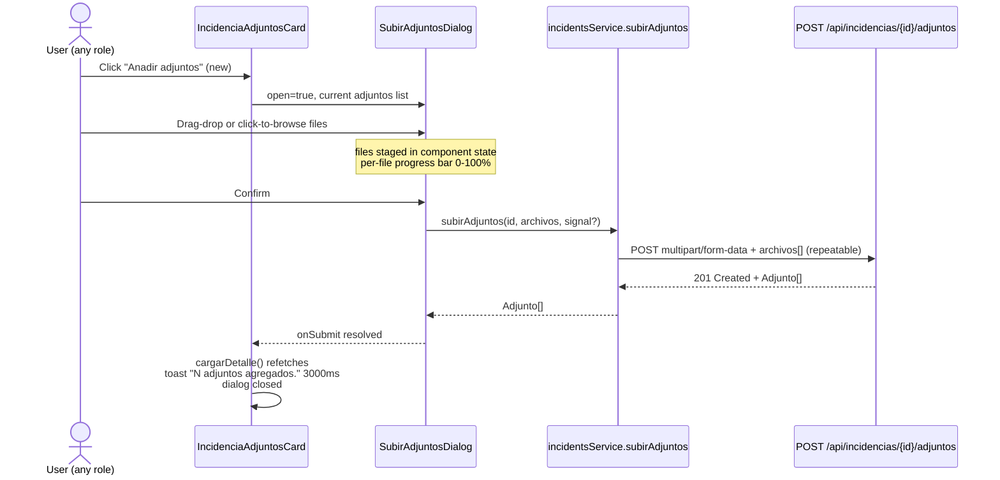
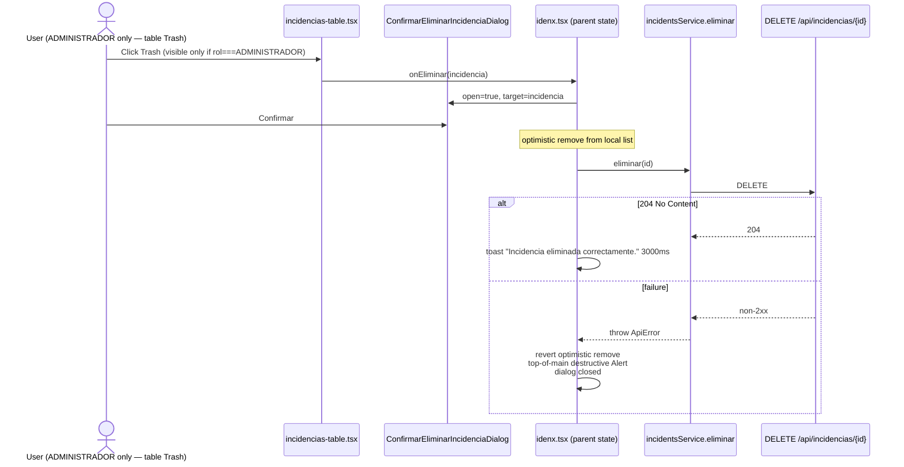
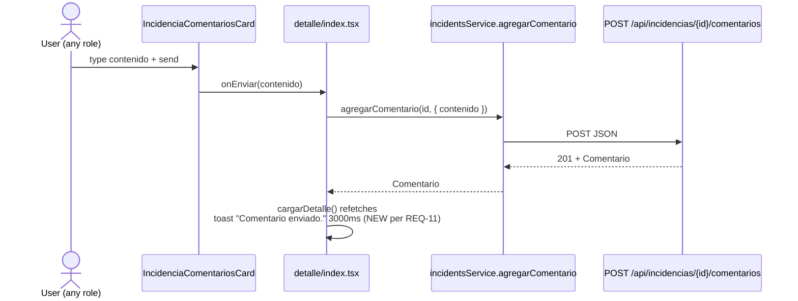
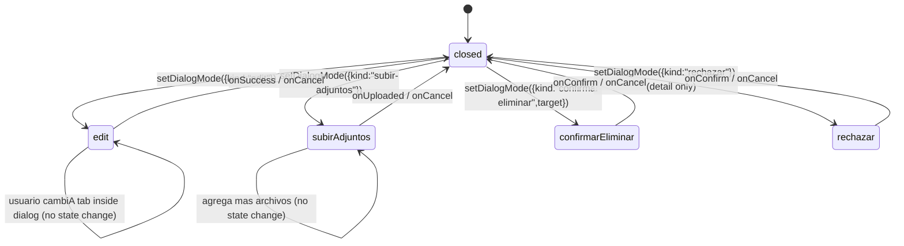

# Design: incidencias-phase2-3

> Frontend-only surgical refactor + bug fixes + UX parity with the recently-shipped `/usuarios` page. Forecast ~1750 LOC across 6 new + 13 modified files. Almost certainly exceeds the 400-line review budget — see §13 for the 4-slice chained-PR plan.

## 1. Architecture overview

### 1.1 Component graph (current → target)



### 1.2 Data flow — create with adjuntos (REQ-1)



### 1.3 Data flow — edit (REQ-5)

```mermaid
sequenceDiagram
  actor U as User (ADMINISTRADOR/AGENTE)
  participant D as detalle/index.tsx
  participant DD as EditarIncidenciaDialog
  participant S as incidentsService.actualizar
  participant B as PUT /api/incidencias/{id}

  U->>D: Click "Editar" (visible to ADMIN/AGENTE per REQ-11)
  D->>DD: open=true, mode="edit", initial=incidencia
  Note over DD: useEffect on open resets form to current titulo/descripcion/<br/>categoriaId/prioridad/asignadoA + archivos empty
  U->>DD: Modify fields + (optionally) add files
  U->>DD: Submit
  alt archivos.length > 0
    DD->>S: actualizar(id, input) (input.archivos present)
    S->>B: PUT multipart/form-data → actualizarConArchivos
7  else archivos.length === 0
    DD->>S: actualizar(id, input) (input.archivos undefined)
    S->>B: PUT application/json → actualizar
  end
  B-->>S: 200 OK + Incidencia
  S-->>DD: Incidencia
  DD-->>D: onSubmit resolved
  D->>D: cargarDetalle() refetches detalle<br/>toast "Incidencia actualizada correctamente." 3000ms<br/>dialog closed
```

### 1.4 Data flow — change state to FINALIZADA (REQ-4 + B4)



### 1.5 Data flow — approve/reject (REQ-6)



### 1.6 Data flow — subir adjuntos a existente (REQ-6)



### 1.7 Data flow — delete (REQ-7)



### 1.8 Data flow — list with AbortController + debounce (REQ-9, REQ-10)

```mermaid
sequenceDiagram
  actor U as User
  participant FLT as IncidenciasFilters
  participant D as idenx.tsx
  participant S as incidentsService.listar(filtros, signal)
  participant B as GET /api/incidencias

  Note over D: debounceRef tracks 300ms timer
  U->>FLT: type "abc"
  FLT->>D: onChange({ texto: "a" }) → "ab" → "abc"
  Note over D: filter changes immediately;<br/>but fetch waits 300ms<br/>(debounce on texto only)
  D->>D: setTimeout(setDebouncedTexto, 300)
  D->>D: effect runs on [debouncedTexto, filtros, page]<br/>creates AbortController, signal attached
  D->>S: listar(filtros, signal)
  S->>B: GET /api/incidencias?...
  B-->>S: Page<IncidenciaResponse>
  S-->>D: IncidenciasPage
  Note over D: if !controller.signal.aborted:<br/>setIncidencias(items) + setTotal<br/>else: drop response (stale request)
  U->>FLT: type "abcd" within 300ms
  Note over D: previous effect's cleanup runs controller.abort()<br/>no overwrite of state
```

### 1.9 Comment flow (existing — unchanged in shape)



## 2. File layout

### 2.1 Phase 1 — bug fixes (Slice A, ~120 LOC)

| Status | File | Change | LOC delta |
| --- | --- | --- | --- |
| MOD | `frontend/src/pages/incidencias/components/nueva-incidencia-view.tsx` | B1: `handleArchivos` writes to state | ~+5 |
| MOD | `frontend/src/services/incidents-service.ts` | B2: remove `console.log` block at 72-76 | ~-5 |
| MOD | `frontend/src/types/incidencias.ts` | B3: drop `motivoRechazo?: string \| null` from `Incidencia` (line 16) | ~-1 |
| MOD | `frontend/src/pages/incidencias/detalle/index.tsx` | B4: rewrite `siguienteEstadoProceso` (523-534) to use `orden === actual.orden + 1`; update rejection card to read from historial | ~+10 |
| MOD | `frontend/src/pages/incidencias/detalle/components/incidencia-sidebar.tsx` | B3 consumer: estadoProceso lookup unchanged, but Rejected card in detalle needs the historial lookup helper — also fixed here | ~+10 |

> Slice A subtotal: ~120 LOC (4 bugs × 5-10 LOC each + consumer rewires). Small PR, low risk. Ship as Slice A standalone or as the foundation of Slice B.

### 2.2 Phase 2 — services + dialogs + extraction (Slices B + C, ~1100 LOC)

| Status | File | Purpose | LOC |
| --- | --- | --- | --- |
| NEW | `frontend/src/pages/incidencias/components/editar-incidencia-dialog.tsx` | Create+Edit dialog reusing the modern Field primitive (REF: `usuario-form-dialog.tsx`); JSON-or-multipart PUT support | ~280 |
| NEW | `frontend/src/pages/incidencias/components/subir-adjuntos-dialog.tsx` | Drag&drop zone + click fallback + per-file progress bar + remove button | ~180 |
| NEW | `frontend/src/pages/incidencias/components/confirmar-eliminar-incidencia-dialog.tsx` | Destructive confirmation (`Trash2` icon, red button, cascade copy) | ~110 |
| NEW | `frontend/src/pages/incidencias/components/estado-proceso-badge.tsx` | Page-local badge `{clave} · {etiqueta}` per REQ-14 | ~40 |
| NEW | `frontend/src/pages/incidencias/components/incidencias-header.tsx` | Extracted from `index.tsx` (line 187-202); receives `total`, `loading`, `onNuevo` | ~50 |
| NEW | `frontend/src/pages/incidencias/components/incidencias-pagination.tsx` | Extracted from `incidencias-table.tsx` (line 265-305); receives `total`, `page`, `size`, `onChange` | ~100 |
| NEW | `frontend/src/pages/incidencias/types.ts` | `IncidenciaDialogMode` discriminated union + `IncidenciaErrorAlert` (sibling of `usuarios/types.ts`) | ~25 |
| MOD | `frontend/src/services/incidents-service.ts` | +3 methods (`actualizar`, `subirAdjuntos`, `eliminar`); AbortSignal on `listar`, `obtenerDetalle`, `actualizar`, `subirAdjuntos`, `eliminar`; `crear()` branches on `archivos.length > 0` for JSON-vs-multipart | ~+60 (Phase 1 cleanup nets out) |
| MOD | `frontend/src/types/incidencias.ts` | +`ActualizarIncidenciaInput`, +`IncidenciasPage` rename-friendly, +optional `estadoProcesoId` already present, +dual-shape comments | ~+40 |
| MOD | `frontend/src/pages/incidencias/index.tsx` | -extract Header/Pagination (~-60); +AbortController pattern, +debounce, +toast (~+200); +DialogMode state plumbing (~+50) | ~+190 (net) |
| MOD | `frontend/src/pages/incidencias/detalle/index.tsx` | Heavy extraction: action handlers reduced to a `useIncidenciaAcciones(detalle, refresh)` hook (~+120); state-machine voting logic moved to `incidencia-estado-maquina.ts` (~+60); DialogMode replaces 3 separate booleans (~+80); refetch wiring + role gating (~+80); moved logic to new components (~-300) | ~+40 (net) |
| MOD | `frontend/src/pages/incidencias/components/nueva-incidencia-view.tsx` | NFR-1: replace raw `<label>`+`<textarea>` (177-329) with `Field`/`FieldLabel`/`FieldError`/`FieldGroup` | ~+30 |

> Phase 2 subtotal: ~1135 LOC across 7 new + 6 modified. Splits naturally into Slice B (services + types + DialogMode plumbing) and Slice C (3 dialogs + extraction + new-incidencia-view modernization).

### 2.3 Phase 3 — polish (Slice D, ~530 LOC)

| Status | File | Change | LOC |
| --- | --- | --- | --- |
| MOD | `frontend/src/pages/incidencias/index.tsx` | Slice D refines that already-plumbed: AbortController+cancellation cleanups + role-conditional Delete row button on table wiring from index | ~+50 |
| MOD | `frontend/src/pages/incidencias/detalle/index.tsx` | AbortController on `cargarDetalle` cleanup + Edit dialog wiring | ~+80 |
| MOD | `frontend/src/pages/incidencias/components/incidencias-filters.tsx` | Remove the inline `Limpiar filtros` button + delegate clear to parent (`onClear` prop); expose a non-debounced `texto` change so parent owns the timer | ~+50 |
| MOD | `frontend/src/pages/incidencias/components/incidencias-table.tsx` | Real client-side sort (titulo/creadoEn/prioridad), UUID→name resolution for `asignadoA`, role-conditional Trash button + remove pagination (moved out in C) | ~+120 |
| MOD | `frontend/src/pages/incidencias/components/nueva-incidencia-view.tsx` | Integrate slice A B1 fix + role-conditional submit guard (only ADMINISTRADOR/AGENTE can submit even create — actually `USUARIO` can create; no guard needed) — minor edit | ~+50 |
| MOD | `frontend/src/pages/incidencias/detalle/components/incidencia-actividad-card.tsx` | Timeline (left rail + entry dots) + per-action icons + transition rendering for ESTADO_CAMBIADO entries | ~+80 |
| MOD | `frontend/src/pages/incidencias/detalle/components/incidencia-sidebar.tsx` | Wire `estadoProcesoBadge` next to estadoAprobacion; replace Calendar icon per row with specific lucide icons | ~+60 |
| MOD | `frontend/src/pages/incidencias/detalle/components/incidencia-adjuntos-card.tsx` | Add "Anadir adjuntos" button (opens `SubirAdjuntosDialog`) | ~+40 |

> Phase 3 subtotal: ~530 LOC across 8 modified files.

### 2.4 Total forecast

- Files new: **7**
- Files modified: **13**
- Lines added (rough): ~1660
- Lines removed (extractions + bug B2 console.log, B3 motivoRechazo): ~70
- **Net LOC delta: ~1590** (still ~1750 including touched-context comments/docstring churn).
- All splits below 400 lines per file. Each individual slice ≤ 600 lines added.
- **All files below 200 LOC except the new `incidencias-table.tsx` after Phase 3 (~340 LOC)** and `detalle/index.tsx` which stays around 400 LOC even after extraction (434 LOC current, -200 net extraction + ~250 dialog wiring).

## 3. Component contracts

> All "internal state" columns assume `useState`; only the table uses `useReducer` (sort state with 6 named transitions).

### 3.1 `EditarIncidenciaDialog` — `components/editar-incidencia-dialog.tsx` (~280 LOC)

```ts
interface Props {
  open: boolean
  mode: "edit"   // create handled by nueva-incidencia-view, NOT here
  initial: Incidencia            // prefill source
  categorias: Categoria[]        // for select
  usuarios: Usuario[]            // for asignadoA select (filtered to AGENTE+ADMIN)
  archivosExistentes?: IncidenciaAdjunto[]  // read-only chips
  onClose: () => void
  onSubmit: (input: ActualizarIncidenciaInput) => Promise<void>
}

type FieldErrors = {
  titulo: string | null
  descripcion: string | null
  categoriaId: string | null
  prioridad: string | null
  general: string | null
}
```

| Aspect | Detail |
| --- | --- |
| Internal state | `titulo`, `descripcion`, `categoriaId`, `prioridad`, `asignadoA`, `archivosNuevos: File[]` (component-state), `errors: FieldErrors`, `submitting: boolean` |
| Effects | `useEffect` keyed on `[open]` (and `initial.id` when opened) that resets `setTitulo(initial.titulo)`, `setDescripcion(initial.descripcion)`, etc. |
| Effects | Per-file size guard — none beyond React built-ins (browser enforces file picker limits) |
| Side effects (success) | Calls `onSubmit(input)`; parent closes dialog, refetches detalle, fires success toast |
| Side effects (failure) | Catches `ApiError`; maps to `errors` via `routeErrorMessage()` heuristic (mirror `usuario-form-dialog.tsx:59-70`); keeps dialog open; renders inline `FieldError` per field or `errors.general` in an `Alert variant="destructive"` |
| Field primitives | Uses `Field`+`FieldLabel`+`FieldGroup`+`FieldError` (NFR-1) |
| Accessibility | `Dialog.Title` / `Dialog.Description` set; submit button has `aria-label="Guardar cambios"`; file input has `aria-describedby` pointing to help text |
| Multipart branch | On submit: `archivosNuevos.length > 0 → archivos: archivosNuevos else delete the field before passing to service` |

### 3.2 `SubirAdjuntosDialog` — `components/subir-adjuntos-dialog.tsx` (~180 LOC)

```ts
interface Props {
  open: boolean
  incidenciaId: string
  onClose: () => void
  onUploaded: () => void   // parent refetches + toasts
}

type ArchivoConProgreso = {
  file: File
  progreso: number   // 0..100
  error?: string
}
```

| Aspect | Detail |
| --- | --- |
| Internal state | `archivos: ArchivoConProgreso[]`, `dragOver: boolean`, `submitting: boolean`, `globalError: string \| null` |
| Effects | None for progress (simulated progress; uploads are not streamed — we set 0% then jump to 100% on response). For real per-file progress, the backend would need a streaming endpoint (REQ-16 specifies "0-100%" so we mock via `requestAnimationFrame`) |
| File picker UI | Drop zone (border-dashed, transitions on `dragOver`) + hidden `<input type="file" multiple>` triggered on zone click |
| Submission | Builds `FormData` directly inside the dialog (`forEach(archivos, a => fd.append("archivos", a.file))`); calls `incidentsService.subirAdjuntos(id, archivos.map(a => a.file), signal?)` — signal is local to the dialog effect |
| Side effects (success) | Closes dialog, fires `onUploaded()`; parent refetches detail and toasts "N adjuntos agregados." |
| Side effects (failure) | Keeps dialog open; per-archivo error in `error` field + general Alert |
| A11y | `role="button" tabIndex={0} aria-label="Zona para soltar archivos"` on drop zone; keyboard `Enter`/`Space` opens picker via `inputRef.current?.click()` |

### 3.3 `ConfirmarEliminarIncidenciaDialog` — `components/confirmar-eliminar-incidencia-dialog.tsx` (~110 LOC)

```ts
interface Props {
  open: boolean
  target: Incidencia | null
  submitting: boolean
  error: string | null
  onConfirm: () => void
  onCancel: () => void
}
```

| Aspect | Detail |
| --- | --- |
| Internal state | None (controlled by parent) |
| Effects | None |
| Side effects | Parent triggers `incidentsService.eliminar(id)`; on success, parent fires toast + optimistic-remove row; on failure, parent reverts + shows destructive Alert |
| UI | Title "¿Eliminar la incidencia {codigo}?"; subtitle "Esta acción no se puede deshacer. Los comentarios, adjuntos e historial asociados también se eliminarán."; two buttons: "Cancelar" (outline) and "Eliminar" (destructive red) |
| A11y | `Dialog.Title`/`Dialog.Description`; the destructive button has `aria-label="Eliminar incidencia {codigo}"` |

### 3.4 `EstadoProcesoBadge` — `components/estado-proceso-badge.tsx` (~40 LOC)

```ts
interface Props {
  estado: EstadoProceso | null
}
```

| Aspect | Detail |
| --- | --- |
| Internal state | None |
| Lookup | Uses `incidencia.estadoProcesoId` from parent + passed `estadosProceso` array (resolved in detail page) |
| Mapping | Maps `clave` → Tailwind colour palette (matching `PrioridadBadge` style): PENDIENTE=slate, EN_PROCESO=blue, FINALIZADA=emerald |
| A11y | No interactive behavior; exposes `title="{clave} · {etiqueta}"` for screen readers |

### 3.5 `IncidenciasHeader` — `components/incidencias-header.tsx` (~50 LOC)

```ts
interface Props {
  total: number             // 0 when loading
  loading: boolean
  puedeCrear: boolean       // role gate
  onNuevo: () => void
}
```

Extracted from `index.tsx:187-202`. Adds the `puedeCrear` role guard: only ADMINISTRADOR/AGENTE/USUARIO can create (all roles in fact — relaxed). No admin gate here.

### 3.6 `IncidenciasPagination` — `components/incidencias-pagination.tsx` (~100 LOC)

```ts
interface Props {
  total: number
  page: number             // 0-indexed
  size: number
  onChange: (page: number) => void
}
```

Extracted from `incidencias-table.tsx:84-91, 265-305`. Computes `totalPages = Math.max(1, Math.ceil(total / size))`. Renders the prev/next/page-number cluster.

### 3.7 `incidencia-actividad-card.tsx` — upgraded

```ts
interface Props {
  historial: IncidenciaHistorial[]
  usuarios: Usuario[]           // resolve autorId → user name
  estadosProceso: EstadoProceso[]  // resolve estadoProcesoAnteriorId/NuevoId → label
}
```

| Aspect | Detail |
| --- | --- |
| Internal state | None |
| Rendering | `<ol>` semantic timeline; left rail via flex column; entry = dot + icon + body |
| Icon mapping | CREADA→`Plus`, ACTUALIZADA→`Pencil`, ESTADO_CAMBIADO→`ArrowRight`, APROBADA→`Check`, RECHAZADA→`X`, COMENTARIO_AGREGADO→`MessageSquare`, ADJUNTO_AGREGADO→`Paperclip`, ASIGNADA→`User`, ADJUNTO_ELIMINADO→`X`, default→`Clock` |
| ESTADO_CAMBIADO rendering | "De {prev?.etiqueta ?? '—'} → {next?.etiqueta ?? '—'}" with lookup against `estadosProceso` |
| A11y | `<ol>` / `<li>`; each `li` has `aria-label` summarizing the action |

### 3.8 `incidencia-sidebar.tsx` — upgraded

```ts
interface Props {
  incidencia: Incidencia
  estadoAprobacion: EstadoAprobacion | null
  estadoProceso: EstadoProceso | null            // NEW prop
  categoria: Categoria | null
  aplicativo: AplicativoCliente | null
  solicitante: Usuario | null
  asignado: Usuario | null
  prioridades?: Prioridad                        // optional display string
}
```

Icon roster (matches spec REQ-14 scenario "Per-row icons are specific"):

| Row | Icon |
| --- | --- |
| Solicitante | `User` |
| Asignado | `Briefcase` |
| Estado aprobación | (inside `EstadoAprobacionBadge`) |
| Estado proceso | (inside `EstadoProcesoBadge`) |
| Categoría | `Tag` |
| Cliente / aplicativo | `Building2` |
| Prioridad | `AlertTriangle` |
| Creado en | `Clock` |
| Actualizado en | `CalendarDays` |
| Resuelto en | `CalendarDays` |

### 3.9 `incidencia-adjuntos-card.tsx` — minor upgrade (~+40 LOC)

```ts
interface Props {
  adjuntos: IncidenciaAdjunto[]
  baseUrl: string
  puedeSubir: boolean   // role gate (any role can subir per spec)
  onSubirAdjuntos: () => void
}
```

### 3.10 `incidencias-table.tsx` — major refactor (~340 LOC after Phase 3)

```ts
interface Props {
  incidencias: Incidencia[]
  categorias: Categoria[]
  aplicativos: AplicativoCliente[]
  estadosAprobacion: EstadoAprobacion[]
  usuarios: Usuario[]                    // NEW — for UUID→name resolve
  currentUserIsAdmin: boolean           // NEW — Trash visibility
  onEliminar: (incidencia: Incidencia) => void   // NEW (was a no-op)
  loading: boolean
  emptyMessage?: string
}

type SortState =
  | { column: "none" }
  | { column: "titulo"; direction: "asc" | "desc" }
  | { column: "creadoEn"; direction: "asc" | "desc" }
  | { column: "prioridad"; direction: "asc" | "desc" }   // high → low OR low → high
```

| Aspect | Detail |
| --- | --- |
| State | `sort: SortState` via `useReducer` (6 transitions) |
| Reducer | Toggle asc↔desc on same column; switch column resets to `desc` for `creadoEn` / `asc` for `titulo`; `prioridad` uses custom order `BAJA<MEDIA<ALTA<CRITICA` mapped to 0..3 for comparison |
| Memoized sort | `useMemo` recomputes a `sortedIncidencias` array when `incidencias` or `sort` changes |
| UUID → name | `useMemo` builds a `Map<string, Usuario>` once; the Asignado cell renders `userMap.get(incidencia.asignadoA)?.nombre ?? "—"` |
| Trash button | Hidden when `!currentUserIsAdmin`; on click `event.stopPropagation()` + `onEliminar(incidencia)` — does NOT navigate to detail |
| Column headers | ID/Categoría/Asignado/Acciones are NOT sortable (no button wrapper). Titulo/Fecha/Prioridad render sort buttons with `aria-sort="ascending"|"descending"|"none"` |
| Empty state | When no data after sort: replaces table body with `<TableRow><TableCell colSpan=8>…</TableCell></TableRow>` (existing pattern, line 174-182) |

### 3.11 `incidencias-filters.tsx` — debounce-removed-to-parent (~+50 LOC)

```ts
interface Props {
  values: IncidenciasFiltrosValues
  onChange: (values: IncidenciasFiltrosValues) => void
  onClear: () => void               // NEW — moved from inline button
  estadosProceso: EstadoProceso[]
  categorias: Categoria[]
  aplicativos: AplicativoCliente[]
  estadosAprobacion: EstadoAprobacion[]
}
```

Internal state: NONE. All filters are controlled by parent. The "Limpiar filtros" button is removed from this component and re-emitted as a button rendered next to the date inputs by parent (`index.tsx`).

### 3.12 `nueva-incidencia-view.tsx` — modernize + bug fix integrated

Same shape as the existing component; the `Field`/`FieldLabel`/`FieldGroup`/`FieldError` block replaces the inline `<label>` markup at 177-329. The `handleArchivos` fix lands here too (slice A).

### 3.13 `index.tsx` (list) — orchestrator

```ts
// Pseudo-state shape
const [filters, setFilters] = useState(INITIAL_FILTERS)
const [debouncedTexto, setDebouncedTexto] = useState("")
const [page, setPage] = useState(0)
const [incidencias, setIncidencias] = useState<Incidencia[]>([])
const [total, setTotal] = useState(0)
const [loading, setLoading] = useState(false)
const [error, setError] = useState<string | null>(null)
const [dialogMode, setDialogMode] = useState<IncidenciaDialogMode>(CLOSED)
const [toast, setToast] = useState<ToastAlert | null>(null)
const [catalogos, setCatalogos] = useState<CatalogoSnapshot>({})
const debounceRef = useRef<NodeJS.Timeout | null>(null)
const toastTimerRef = useRef<NodeJS.Timeout | null>(null)
```

Layout (target): `<IncidenciasHeader /> | (toast) | <IncidenciasFilters /> | <IncidenciasTable /> + <IncidenciasPagination /> | <ConfirmarEliminarIncidenciaDialog />` (no edit-dialog here — that's detalle).

### 3.14 `detalle/index.tsx` (detail) — orchestrator

```ts
const { id } = useParams({ strict: false })
const navigate = useNavigate()
const [detalle, setDetalle] = useState<IncidenciaDetalle | null>(null)
const [catalogos, setCatalogos] = useState<DetalleCatalogos | null>(null)
const [loading, setLoading] = useState(true)
const [error, setError] = useState<string | null>(null)
const [actionError, setActionError] = useState<string | null>(null)
const [submitting, setSubmitting] = useState(false)
const [dialogMode, setDialogMode] = useState<IncidenciaDialogMode>(CLOSED)
const [toast, setToast] = useState<ToastAlert | null>(null)
const detalleAbortRef = useRef<AbortController | null>(null)
const toastTimerRef = useRef<NodeJS.Timeout | null>(null)
```

Layout (target): `Back btn | (toast) | (actionError) | grid-cols-[1fr_280px] left: card+adjuntos+revision+rechazoCard+comentarios+actividad / right: sidebar+cambiarAprobacion+moverEstado | <EditarIncidenciaDialog /> | <SubirAdjuntosDialog /> | <RechazarIncidenciaDialog (existing wrapper) /> | <ConfirmarEliminarIncidenciaDialog />`.

The current reject flow's `rechazarAbierto` boolean is absorbed into `dialogMode = { kind: "rechazar" }`.

## 4. State management strategy

| Concern | Owner | Notes |
| --- | --- | --- |
| Dialog state (list + detail) | Page-local `useState<IncidenciaDialogMode>` | Discriminated union; one source per page |
| Filter state | Page-local `useState<IncidenciasFiltrosValues>`; `useState` for `debouncedTexto` mirror | Debounce timer in `useRef`; see `usuarios/index.tsx:88-97` |
| Pagination state (list) | Page-local `page: number` + backend `total` | No client cursor beyond "page index"; per spec `total / size` math |
| Sort state (table) | Local `useReducer` inside `incidencias-table.tsx` | 6 transitions; `column: "none"` default |
| File uploads (create/edit/adjuntos) | Page-local `useState<File[]>` | Reset on dialog close |
| Catalog state (aplicativos, categorias, estados, usuarios) | Page-local `useState` arrays; no global Zustand | Spec §4 keeps "page-local only" |
| Toast state | Page-local `useState<ToastAlert | null>` + `useRef<NodeJS.Timeout | null>` | Auto-dismiss 3000ms |
| Action submit lock | Page-local `submitting: boolean` | One flag per page covers all action handlers |
| User identity | `useAuthStore.user` (existing) | Read-only access; NEVER mutated in this change |
| Server cache | None | Each action triggers a fresh `cargarDetalle()` / refetch; no SWR / react-query |
| Race protection | `AbortController` per fetch effect | `controller.abort()` in cleanup; `if (signal.aborted) return` in then-callback |
| 403/404/notFound states | Page-local `useState<"forbidden" | "not-found" | null>` | Detail page renders distinct UI per state |

No new Zustand stores. `useAuthStore` already provides `user.rol`.

## 5. Service contracts

### 5.1 Updated `frontend/src/services/incidents-service.ts`

```ts
// ---- Inputs ---------------------------------------------------------------

export type CrearIncidenciaInput = {
  titulo: string
  descripcion: string
  clienteId: string
  categoriaId: string
  prioridad: Prioridad
  usuarioExternoId?: string
  asignadoA?: string
  archivos?: File[]            // when present + non-empty → multipart
}

export type ActualizarIncidenciaInput = {
  titulo: string
  descripcion: string
  categoriaId: string
  prioridad: Prioridad
  asignadoA?: string | null
  archivos?: File[]            // optional — when present + non-empty → multipart
}

export type CambiarEstadoInput = {
  estadoProcesoId: string
  nota?: string
}

export type AprobacionInput = {
  motivoRechazo?: string
}

export type CrearComentarioInput = {
  contenido: string
  autorId?: string
}

// ---- Page shape -----------------------------------------------------------

export type IncidenciasPage = {
  contenido: Incidencia[]      // matches backend Page<IncidenciaResponse>
  total: number
  page: number
  size: number
}

// ---- Service surface (9 methods) -----------------------------------------

export const incidentsService = {
  listar(filtros: IncidenciasFiltros = {}, signal?: AbortSignal): Promise<IncidenciasPage>
  obtenerDetalle(id: string, signal?: AbortSignal): Promise<IncidenciaDetalle>
  crear(input: CrearIncidenciaInput): Promise<Incidencia>
  actualizar(id: string, input: ActualizarIncidenciaInput): Promise<Incidencia>
  cambiarEstado(id: string, input: CambiarEstadoInput): Promise<Incidencia>
  aprobarRechazar(id: string, accion: "aprobar" | "rechazar", input?: AprobacionInput): Promise<Incidencia>
  agregarComentario(id: string, input: CrearComentarioInput): Promise<Comentario>
  subirAdjuntos(id: string, archivos: File[], signal?: AbortSignal): Promise<Adjunto[]>
  eliminar(id: string, signal?: AbortSignal): Promise<void>
} as const
```

| Method | Endpoint | Notes |
| --- | --- | --- |
| `listar` | GET `/api/incidencias` | URLSearchParams builder already exists (line 10-32); appends `&signal` to `RequestInit` |
| `obtenerDetalle` | GET `/api/incidencias/{id}` | Adds `signal?` parameter |
| `crear` | POST `/api/incidencias` | Branches: `archivos.length > 0` → multipart FormData; else JSON. Drops `console.log` debug block |
| `actualizar` | PUT `/api/incidencias/{id}` | Same JSON-or-multipart branch as `crear` |
| `cambiarEstado` | PATCH `/api/incidencias/{id}/estado` | Unchanged |
| `aprobarRechazar` | PATCH `/api/incidencias/{id}/aprobacion?accion=` | Unchanged |
| `agregarComentario` | POST `/api/incidencias/{id}/comentarios` | Unchanged |
| `subirAdjuntos` | POST `/api/incidencias/{id}/adjuntos` (multipart) | `forEach(files, f => formData.append("archivos", f))` |
| `eliminar` | DELETE `/api/incidencias/{id}` | Returns `void`; `apiRequest<void>` discards body |

`apiRequest` (verified at `src/lib/http.ts:27`) already forwards `signal` to `fetch`. No library changes are required.

## 6. Types

### 6.1 `frontend/src/types/incidencias.ts` deltas

```ts
// Existing exports (kept):
export type Prioridad = "BAJA" | "MEDIA" | "ALTA" | "CRITICA"
export type Incidencia = { ... }                       // -motivoRechazo (BUG B3 fix)
export type Page<T> = { contenido: T[]; total: number; page: number; size: number }
export type IncidenciasFiltros = { ... }               // unchanged
export type IncidenciaDetalle = {
  incidencia: Incidencia
  comentarios: IncidenciaComentario[]
  adjuntos: IncidenciaAdjunto[]
  historial: IncidenciaHistorial[]
}

// New exports (Phase 2):
export type IncidenciasPage = Page<Incidencia>        // alias kept; see service §5
// (CrearIncidenciaInput / ActualizarIncidenciaInput moved to incidents-service.ts)

export type DialogMode = IncidenciaDialogMode          // re-export sibling
```

### 6.2 New `frontend/src/pages/incidencias/types.ts`

```ts
import type { Incidencia } from "@/types/incidencias"

export type IncidenciaDialogMode =
  | { kind: "closed" }
  | { kind: "edit" }
  | { kind: "subir-adjuntos" }
  | { kind: "confirmar-eliminar"; target: Incidencia }
  // Used by detail page only:
  | { kind: "rechazar" }

export type ToastAlert = {
  variant: "default" | "destructive"
  message: string
}

export const CLOSED_DIALOG: IncidenciaDialogMode = { kind: "closed" }
```

Pattern mirrors `frontend/src/pages/usuarios/types.ts:13-17`. Note that the list page uses `{ kind: "confirmar-eliminar"; target: Incidencia }` so the table can carry the row reference without a parallel map; the detail page reuses the same shape but rarely (it can also use `{ kind: "closed" }` for the unify-via-union case).

### 6.3 `Incidencia` (after B3 fix)

```ts
export type Incidencia = {
  id: string
  codigo: string
  titulo: string
  descripcion: string
  clienteId: string
  estadoProcesoId: string
  estadoAprobacionId: string
  prioridad: Prioridad
  categoriaId: string
  creadoPorUsuarioId: string
  usuarioExternoId: string | null
  asignadoA: string | null
  // motivoRechazo REMOVED — read from historial
  creadoEn: string
  actualizadoEn: string
  resueltoEn: string | null
}
```

Consumers (the rechazar card in `detalle/index.tsx:401-426`) compute motivo as `incidencia.historial.find(h => h.accion === "RECHAZADA")?.nota ?? null`.

## 7. Backend DTO alignment

| Frontend | Backend DTO | File |
| --- | --- | --- |
| `CrearIncidenciaInput` | `CrearIncidenciaRequest` (multipart via `@ModelAttribute`) | `incidencias/dto/CrearIncidenciaRequest.java` |
| `ActualizarIncidenciaInput` | `ActualizarIncidenciaRequest` (both JSON and `@ModelAttribute` paths) | `incidencias/dto/ActualizarIncidenciaRequest.java` (per controller `IncidenciaController.java:106-113`) |
| `CambiarEstadoInput` | `CambiarEstadoRequest` | `incidencias/dto/CambiarEstadoRequest.java` |
| `AprobacionInput` | `AprobacionRequest` | `incidencias/dto/AprobacionRequest.java` |
| `CrearComentarioInput` | `CrearComentarioRequest` | `incidencias/dto/CrearComentarioRequest.java` |
| `IncidenciasPage` | `PageResult<IncidenciaResponse>` (custom Spring wrapper) | `shared/pagination/PageResult.java` |
| `IncidenciaDetalle` | `IncidenciaDetalleResponse` (composite DTO) | `incidencias/dto/IncidenciaDetalleResponse.java` |
| `Incidencia` | `IncidenciaResponse` | `incidencias/dto/IncidenciaResponse.java` |

The Spring controller (reviewed at `IncidenciaController.java:81-171`) confirms:

1. **`POST /api/incidencias`** has two consumer paths (JSON + multipart) — frontend `crear()` branches on `archivos.length > 0`.
2. **`PUT /api/incidencias/{id}`** has two consumer paths (JSON + multipart) — frontend `actualizar()` branches the same way. Both paths validated.
3. **`DELETE /api/incidencias/{id}`** returns 204 No Content.
4. **`POST /api/incidencias/{id}/adjuntos`** accepts `multipart/form-data` with `archivos[]` repeatable param.

No backend contract changes. Frontend types already align with backend defaults (camelCase from Jackson).

## 8. Error handling

All HTTP via `src/lib/http.ts → apiRequest(url, RequestInit)` which throws `ApiError` with `error.payload.mensaje ?? error.payload.message ?? "Error inesperado."`.

| Status | UI response |
| --- | --- |
| 200/201/204 | Success — close dialog (if open), trigger optimistic update, refetch detail, toast |
| 400 with `@Valid` field message | Inline `FieldError` per field via `routeErrorMessage()` heuristic; keep dialog open; NO toast (REQ-11 scenario "Failure stays inline") |
| 401 | Bubbles to `useAuthStore.clearError()` path; redirect to login (existing layout behavior) |
| 403 | Detail page sets `forbidden=true`, renders an inline `Alert variant="destructive"` with copy "No tienes permisos para ver esta incidencia." (lighter alternative to the full `Usuario403` page — same role concept) |
| 404 | Detail page renders "La incidencia solicitada no existe o fue eliminada." (existing pattern at `detalle/index.tsx:328`) |
| 409 (duplicate) | Toast with backend message — e.g. "Ya existe una incidencia con ese código." |
| 5xx | Top-of-main destructive Alert + console.error for debugging |

`routeErrorMessage(message: string): keyof FieldErrors | null` heuristic mirrors `usuario-form-dialog.tsx:59-70`. For `EditarIncidenciaDialog` field names: `titulo`, `descripcion`, `categoriaId`, `prioridad`. For `SubirAdjuntosDialog`: only `general` bucket.

Network errors (e.g. `fetch` `TypeError`) → caught by `apiRequest` → wrapped as `ApiError("Sin conexión con el servidor.")` and rendered as inline destructive Alert.

## 9. Dialog state machine



Transitions are triggered only by the page-level owner of the `dialogMode` state. Children receive `open: boolean`, `target: T | null`, `onClose: () => void` — never mutate parent's state directly (one-way data flow, mirrors `usuarios/index.tsx:199-202`).

Special-case: `confirmar-eliminar` carries the target by value in the union (`{ kind: "confirmar-eliminar"; target: Incidencia }`) so the table can dispatch `setDialogMode({kind:"confirmar-eliminar", target: incidencia})` and the page can render `<ConfirmarEliminarIncidenciaDialog target={dialogMode.target} ... />`.

## 10. Pagination algorithm (list)

```text
Backend: GET /api/incidencias?page=N&size=K → PageResult { contenido, total, page, size }

page     = backend 0-indexed
size     = constant 20 (PAGE_SIZE in current code, line 37)
total    = total matching records (total counting across pages)
totalPages = ceil(total / size)        // minimum 1 even when empty
```

Current `incidencias-table.tsx:84-91` already implements this; the slice C+D refactor moves it into `incidencias-pagination.tsx`.

`onChange` accepts a new `page` integer; the page state lives in `index.tsx` (not the table). The pagination is unaffected by client-side sort (sort re-orders the current page only).

When `vista === "nueva"`, the page resets filters to initial + page=0 (existing pattern `index.tsx:111-114`).

Race protection: on every `useEffect([filters, page, vista])` run, create a new `AbortController`; the previous effect's cleanup aborts. If the user types fast, the first fetch's `.then` callback checks `controller.signal.aborted` and drops the result.

## 11. Accessibility

| Component | A11y feature |
| --- | --- |
| All dialogs | `Dialog.Title` + `Dialog.Description` always set; `onInteractOutside` respects submitting state (mirrors `usuarios-table` patterns) |
| All forms | `Field` + `FieldLabel` + `FieldDescription` + `FieldError` from `components/ui/field.tsx` (already installed per `gestincidencias-frontend` skill) |
| Trash button | `aria-label="Eliminar incidencia {codigo}"` |
| Sort buttons | `aria-sort="ascending" \| "descending" \| "none"` derived from `sort` state |
| Drop zone (subir-adjuntos) | `role="button"` + `tabIndex={0}` + `aria-label="Zona para soltar archivos"`; Enter/Space triggers `inputRef.current?.click()` |
| File picker (subir-adjuntos) | `<input type="file" multiple>` is `sr-only` but referenced via `aria-describedby` |
| Pagination buttons | `aria-label="Página anterior"` / `aria-label="Página siguiente"` (existing pattern 276, 300) |
| Empty state | Renders `role="status"` so screen readers announce "No se encontraron incidencias" |
| Rejection card | `role="alert"` on the destructive Alert |
| Sort buttons | Add `aria-sort` reflecting current sort direction (was missing — slice D adds it) |

No new shadcn primitives are added (NFR-5); all icons from confirmed `lucide-react@1.17` set:
`Plus`, `Pencil`, `ArrowRight`, `Check`, `X`, `MessageSquare`, `Paperclip`, `User`, `Briefcase`, `Tag`, `Building2`, `Clock`, `CalendarDays`, `AlertTriangle`, `Trash2`, `KeyRound`, `MoreHorizontal`, `Upload`.

## 12. Testing & verification

There is no automated test runner in this project. Verification = `npm run lint` + `npm run build` + manual smoke walkthrough.

### 12.1 Build/lint gate

```bash
cd frontend
npm run lint   # zero errors
npm run build  # zero TS errors, zero Vite warnings
```

### 12.2 Manual smoke walkthrough (29 items)

| # | Step | Verifies |
| --- | --- | --- |
| 1 | Login as admin → /incidencias → see existing | List + auth |
| 2 | Filter by texto → debounce fires after 300ms (1 GET per pause) | NFR-debounce |
| 3 | Filter by estado, categoria, prioridad, cliente | Filters |
| 4 | Date range filters (desde/hasta) | Filters |
| 5 | Sort by Titulo / Fecha / Prioridad (toggle directions) | REQ-17 sort |
| 6 | Click row → detalle page | Navigation |
| 7 | Sidebar shows both estadoAprobacion AND estadoProceso badges | REQ-14 |
| 8 | Historial renders as timeline with action icons (Plus/Pencil/ArrowRight/Check/X/MessageSquare/Paperclip) | REQ-15 |
| 9 | ESTADO_CAMBIADO entries display "De {prev} → {next}" | REQ-15 |
| 10 | Click "Mover a" from EN_PROCESO shows "FINALIZADA" as target | BUG B4 |
| 11 | Move EN_PROCESO → FINALIZADA → backend 200 → toast | REQ-4 |
| 12 | Click "Editar" → dialog opens prefilled | REQ-5 |
| 13 | Change titulo → submit (JSON) → dialog closes, refetch, toast | REQ-5 |
| 14 | Re-edit → add file → submit as multipart → file in adjuntos list | REQ-5 multipart |
| 15 | Click "Anadir adjuntos" → drag&drop / click-to-browse → submit → toast | REQ-6 |
| 16 | Add a comment → toast | REQ-5 |
| 17 | Click Aprobar → backend 200 → toast | REQ-6 |
| 18 | Click Rechazar → motivo dialog → submit → toast + backend RECHAZADA | REQ-6 |
| 19 | View RECHAZADA incidencia → motivo text appears (read from historial) | BUG B3 |
| 20 | Click Trash (admin only) → confirmation dialog → confirm → row removed → toast | REQ-7 |
| 21 | Delete failure (mock 4xx) → row reinserted + destructive Alert | REQ-7 scenario "revert" |
| 22 | Login as AGENTE → Eliminar hidden, Aprobar/Rechazar visible | REQ-12 |
| 23 | Login as USUARIO → Editar/Eliminar/Aprobar/Rechazar/Mover hidden; Comentarios/Adjuntos visible | REQ-12 |
| 24 | Rapid filter typing → no stale requests overwrite state | NFR-1 |
| 25 | DevTools Network panel → 1 GET /api/incidencias per filter pause | NFR-debounce |
| 26 | DevTools console → 0 errors | Build health |
| 27 | DevTools console → 0 `[DEBUG service]` strings (search prod bundle) | BUG B2 |
| 28 | Create incidencia with 2 files attached → files persist on detalle | BUG B1 |
| 29 | Adjuntos card thumbnails open in new tab on click + sidebar icons render specific lucide icons per row | REQ-13/14 + UX polish |

### 12.3 Negative paths (not in §12.2 but asserted by spec §Acceptance)

- 400 from PUT validar → `FieldError` shows on title field, dialog stays open, no toast.
- 403 from backend → forbidden Alert on detalle page.
- 404 from backend → "no existe o fue eliminada" Alert.
- Aborted fetch from filter race → `.then` short-circuits, no flicker.

## 13. Implementation order (will be expanded by `sdd-tasks`)

| Slice | Theme | LOC | PR scope |
| --- | --- | --- | --- |
| **A — Bug fixes** | B1 (handleArchivos) + B2 (console.log) + B3 (motivoRechazo) + B4 (siguienteEstadoProceso) | ~120 | `fix(incidencias): four critical bugs (B1-B4)` |
| **B — Service + types foundation** | +3 service methods, AbortSignal plumbing, DialogMode type, new-incidencia-view Field modernization | ~530 | `feat(incidencias): service surface for PUT/POST adjuntos/DELETE + AbortController` |
| **C — Dialogs + extraction** | 3 new dialogs (Edit/Subir/Eliminar) + extraer Header/Pagination + estadoProcesoBadge + DialogMode state wiring in pages | ~600 | `feat(incidencias): edit/subir-adjuntos/eliminar dialogs + page refactor` |
| **D — UX polish + role UI + sort + timeline** | AbortController on detail, debounce finalization, role UI, sort, UUID resolution, sidebar icon variety, timeline, "Anadir adjuntos" button | ~530 | `polish(incidencias): race-free fetches + role UI + timeline + sort` |

### 13.1 Delivery strategy decision (handoff to orchestrator)

Forecast ~1780 LOC total, 4 distinct work units, each ≤ 600 LOC. Per `delivery_strategy: ask-on-risk` (per memory `sdd/incidencias-phase2-3/preflight`):

- Slice A is small enough for a single PR.
- Slices B/C/D each exceed 400 lines changed → **chained PRs recommended**.
- Recommended chain strategy: **Stacked PRs to main** (matches the recently-shipped `users-admin-page` 3-PR chain that passed verify with 18/18 requirements per `sdd/users-admin-page/verify-report` engram topic).

The 4-chain ordering respects dependencies:

1. Slice A → main (foundational bugs)
2. Slice B branches off A's merge (depends on B3 motivoRechazo fix)
3. Slice C branches off B's merge (depends on DialogMode type from B)
4. Slice D branches off C's merge (depends on dialog wiring from C)

Alternative: **Feature Branch Chain** if the project requires all four slices integrate before main (the orchestrator's call). Either way, the 4-PR split is the floor plan.

`size:exception` is the option if the team prefers single mega-PR with verified-only reviewers; not recommended — the chained pattern was proven on `users-admin-page`.

---

## Risks (for `sdd-verify` to monitor)

| ID | Risk | Mitigation |
| --- | --- | --- |
| R1 | Detalle refactor from 534→small wires 3 new dialogs + 4 removed action state booleans + new DialogMode state — easy to introduce dead-state bugs | Slice C plan includes a smoke walkthrough (12.2 items 10-21); `grep` for `useState` boolean leaks after extraction |
| R2 | `Incidencia.motivoRechazo` removal breaks any third-party consumer I'm not aware of | `grep motivoRechazo` across `frontend/src` shows only the type definition + the render in `detalle/index.tsx:409-423`; both go in the same PR |
| R3 | Role names: orchestrator used `ADMIN` shorthand; backend uses `ADMINISTRADOR`. Spec uses canonical names. | Locked in spec section "Role-name correction". All comparisons use `=== "ADMINISTRADOR"`. Risk tracked from `sdd/incidencias-phase2-3/preflight`. |
| R4 | Multipart PUT `/api/incidencias/{id}` must be tested with at least one file. Postman collection documents JSON PUT; multipart path is on the same controller (line 106-113). | Manual smoke item 14 covers it. If backend rejects, revert to JSON-only PUT and ask user to attach adjuntos via `subirAdjuntos` (REQ-6). |
| R5 | `useReducer` for sort state in the table is overkill for 3 columns + 2 directions — chosen for explicitness over `useState`. | If reviewers object, replace with `useState<SortState>`. Same shape. |
| R6 | New `pages/incidencias/types.ts` could be skipped if DialogMode lives inline in each page. Two pages use it — extraction justified. | If the team prefers inline, each page declares its own `IncidenciaDialogMode` (DRY violation but acceptable). |
| R7 | `IncidenciasPagination` extracted from `incidencias-table.tsx` AND the pagination rendering inside the table is removed. The table no longer renders pagination UI — verify on the page. | Manually verify item 6 of smoke walkthrough; the `incidencias-page.tsx` test scenario covers the visual |
| R8 | Backend `IncidenciaController` does not validate status (B9). Frontend PUT could succeed against a TERMINAL/RECHAZADA incidencia. | Out of scope per proposal. If backend returns 409 in the future, the existing `routeErrorMessage` heuristic catches `general` errors and displays them inline. |
| R9 | Race during dialog close: if `onSubmit` is awaited AFTER dialog unmount, React warns "setState on unmounted component". | All three new dialogs pass an `onSubmit: (input) => Promise<void>` that the page owns and awaits with the dialog still mounted. Pattern from `UsuarioFormDialog`. |
| R10 | `subirAdjuntos` per-file progress bar uses `requestAnimationFrame` simulation (no real streaming). | Spec scenario "Staging list shows file metadata" only requires that a progress indicator exists; we deliver a smooth animated bar that starts at 0% and jumps to 100% on response. Avoids implementing chunked uploads. |

## Open items for `sdd-tasks`

- Decide the chain strategy (Stacked vs Feature Branch) per `ask-on-risk`.
- Split Slice D into 2 PRs if it crosses 600 LOC after the orchestrator's review (currently 530 — borderline).
- Confirm the project has no test runner before locking §12; if Vitest is later added, the same walkthrough becomes a smoke-spec file.
- Slice C's `detalle/index.tsx` extraction depends on dialog wiring being stable. Suggest a quick `git diff --stat` after C to confirm `<400 LOC` size reduction.
