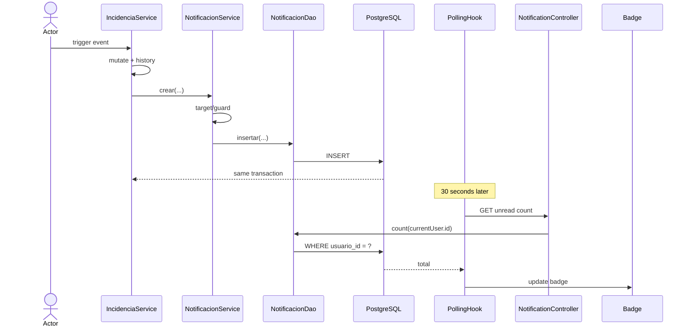

# Design: Notificaciones con polling 30s + centro + badge


**Capability**: `notificaciones` (NEW)


**Change**: `notificaciones-realtime`


**Date**: 2026-07-14


**Status**: designed


## 1. Architectural decisions (D1-D7)


| ID | Decision | Rationale |
|---|---|---|
| D1 | Poll every 30s | No SSE/WebSocket infrastructure |
| D2 | Reuse script-004 table | DB truth; no migration |
| D3 | Hook in `IncidenciaService` | Same-transaction rollback safety |
| D4 | VARCHAR + `NotificacionTipo` | Flexible storage, typed Java |
| D5 | `leido_en` read flag | No receipt table |
| D6 | SQL owner predicate | Client cannot widen scope |
| D7 | Manual deletion only | No retention scheduler |


Polling matches `dashboard-real`.


Self-events are suppressed.


## 2. Backend architecture


### 2.1 Module


```text
notificaciones/
├── model/
├── dao/
├── sql/
├── service/
├── controller/
└── dto/
```


Service owns transactions.


### 2.2 Endpoints


| Method | Route |
|---|---|
| GET | `/api/notificaciones?page=&size=&soloNoLeidas=` |
| GET | `/api/notificaciones/no-leidas/count` |
| PATCH | `/api/notificaciones/{id}/leida` |
| POST | `/api/notificaciones/marcar-todas-leidas` |
| DELETE | `/api/notificaciones/{id}` |


All call `validarAutenticado(token)`.


Dropdown uses list with `page=0&size=10`.


### 2.3 Helper


```text
NotificacionService.crear(
  usuarioId,
  tipo,
  incidenciaId,
  titulo,
  descripcion
)
```


Internal only.


Skips null recipients and self-events.


### 2.4 SQL


All statements are parameterized.


`listar(usuarioId,page,size,soloNoLeidas)`:


```sql
WHERE usuario_id = ?
  [AND leido_en IS NULL]
ORDER BY creado_en DESC
LIMIT ? OFFSET ?
```


Count mirrors WHERE.


`contarNoLeidas(usuarioId)`:


```sql
WHERE usuario_id = ?
  AND leido_en IS NULL
```


`marcarLeida(id,usuarioId,leidoEn)`:


```sql
SET leido_en = COALESCE(leido_en, ?)
WHERE id = ? AND usuario_id = ?
RETURNING leido_en
```


`marcarTodasLeidas(usuarioId,leidoEn)`:


```sql
WHERE usuario_id = ?
  AND leido_en IS NULL
```


`eliminar(id,usuarioId)`:


```sql
WHERE id = ?
  AND usuario_id = ?
```


`insertar(usuarioId,tipo,incidenciaId,titulo,descripcion)`:


```sql
INSERT INTO notificaciones (...)
VALUES (?, ?, ?, ?, ?, ?)
```


### 2.5 DTOs and enum


`NotificacionResponse`: IDs, type, text, read flag, timestamps.


`NotificacionCountResponse`: `total`.


`NotificacionTipo`: ASIGNADA, APROBADA, RECHAZADA, ESTADO_CAMBIADO, COMENTARIO.


### 2.6 Generation hooks


| Site | Target |
|---|---|
| assign/create/update | assignee |
| approve/reject | creator |
| state/comment | creator + assignee |


Deduplicate targets; exclude actor.


## 3. Frontend architecture


### 3.1 Service


`notificaciones-service.ts`: obtener, count, marcarLeida, marcarTodas, eliminar.


Reuses `apiRequest`.


### 3.2 Header/dropdown


`app-header.tsx` replaces hardcoded `4`.


`NotificationDropdown`: latest ten + “Ver todas”.


Badge hides at zero.


### 3.3 Center


`pages/notificaciones/index.tsx`: pagination, unread filter, read/delete, bulk-read, navigation.


### 3.4 Polling


`useNotificacionesPolling`: 30s; pause hidden; refresh visible; cleanup unmount.


## 4. Files affected (complete list)


### Backend — add


- `sistemaincidencias/src/main/java/com/integrador/sistemaincidencias/notificaciones/controller/NotificacionController.java`


- `sistemaincidencias/src/main/java/com/integrador/sistemaincidencias/notificaciones/service/NotificacionService.java`


- `sistemaincidencias/src/main/java/com/integrador/sistemaincidencias/notificaciones/dao/NotificacionDao.java`


- `sistemaincidencias/src/main/java/com/integrador/sistemaincidencias/notificaciones/sql/NotificacionSql.java`


- `sistemaincidencias/src/main/java/com/integrador/sistemaincidencias/notificaciones/model/Notificacion.java`


- `sistemaincidencias/src/main/java/com/integrador/sistemaincidencias/notificaciones/model/NotificacionTipo.java`


- `sistemaincidencias/src/main/java/com/integrador/sistemaincidencias/notificaciones/dto/NotificacionResponse.java`


- `sistemaincidencias/src/main/java/com/integrador/sistemaincidencias/notificaciones/dto/NotificacionCountResponse.java`


### Backend — modify


- `sistemaincidencias/src/main/java/com/integrador/sistemaincidencias/incidencias/service/IncidenciaService.java`


- `sistemaincidencias/postman/SistemaIncidencias.postman_collection.json`


### Frontend — add


- `frontend/src/services/notificaciones-service.ts`


- `frontend/src/hooks/use-notificaciones-polling.ts`


- `frontend/src/components/notifications/notification-dropdown.tsx`


- `frontend/src/pages/notificaciones/index.tsx`


- `frontend/src/pages/notificaciones/components/notificaciones-table.tsx`


### Frontend — modify


- `frontend/src/layout/app-header.tsx`


- `frontend/src/router.tsx`


### Unchanged


- script `004`


- `SecurityConfig.java`


- dependency manifests


No new dependencies.


## 5. Data flow





## 6. Performance


- Poll: one GET/30s/active user.


- 400 active: 48,000/hour.


- ~12,000/hour: 25% concurrency.


- Hidden tabs: zero polls.


- Recommended index: `notificaciones(usuario_id,leido_en,creado_en DESC)`.


- Mark-read: one UPDATE.


- Generation: one INSERT; parent transaction.


- Migration: none.


## 7. Security


- `validarAutenticado` on every endpoint.


- Reads: `WHERE usuario_id = ?`.


- PATCH/DELETE: owner predicate.


- Non-owner: 404.


- UUID parsing and bounded pagination.


- Parameterized SQL.


- Text-only rendering.


### Threat matrix


| Boundary | Applicability |
|---|---|
| Documentation paths | N/A: no execution |
| Repository selection | N/A: no VCS |
| Commit state | N/A: no commits |
| Push state | N/A: no pushes |
| PR commands | N/A: no PR automation |


No matrix RED tests.


## 8. Out of scope


Mirrors proposal §6:


- SSE/WebSocket


- external channels


- preferences


- grouping/digests


- automatic retention


- automatic read


- bulk delete


- deletion/auth hooks


- Redis/brokers


- OpenAPI


- table changes


## 9. Test strategy


No automated tests; project convention.


Code-audit all five endpoint queries:


- parameter order


- owner predicates


- affected rows/404


Audit helper INSERT and transaction placement.


Manual smoke:


1. ADMIN triggers approval.


2. AGENTE badge updates after polling.


3. Bell loads ten.


4. Click marks read and navigates.


5. Cross-user mutation returns 404.


6. Hidden tab stops polling.


Gates: backend compile/test; frontend lint/build; Postman; no hardcoded badge.


## 10. Open questions


None.


Q1-Q5 resolved: polling; five types; explicit targets; no retention; explicit read.
