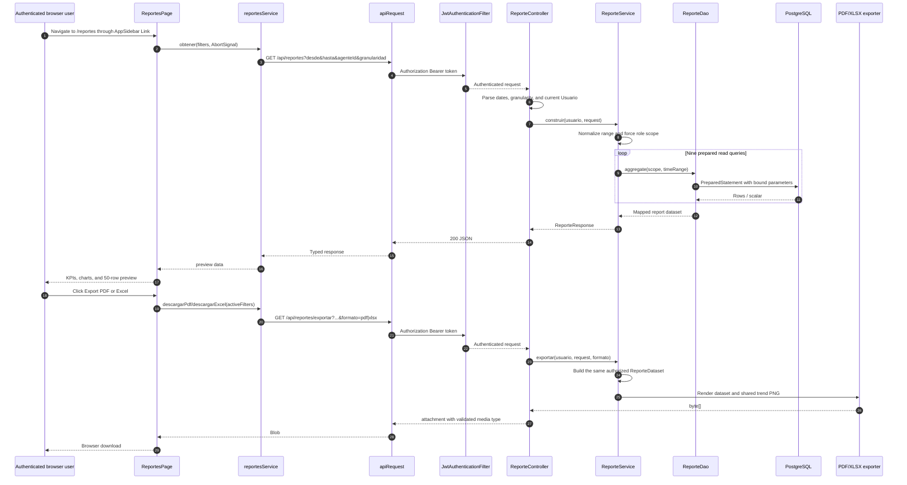

# Design: Reportes con exportación PDF/Excel

**Capability**: `reportes` (NEW)  
**Change**: `reportes-export`  
**Date**: 2026-07-14  
**Status**: designed  
**Depends on**: `incidencias-rbac-agente` and `dashboard-real` (both archived in master). The design reuses `PermisoAdministracionService.validarAutenticado`, the PostgreSQL DAO convention, `IncidenciaResumenResponse`, `apiRequest`, and the existing private `AppLayout`.

## 1. Architectural decisions

### D1 — One JSON endpoint plus one binary export endpoint

`GET /api/reportes` returns the complete preview dataset in one response. `GET /api/reportes/exportar` returns the same dataset rendered as PDF or XLSX. Splitting KPIs, trend, categories, and agents into individual endpoints would create a waterfall of requests, loading states, and authorization opportunities. Keeping export as a separate route preserves a readable JSON contract and matches the project endpoint inventory while sharing one service pipeline.

### D2 — Authorization is derived from the authenticated `Usuario`

The controller resolves the user with `validarAutenticado(Authorization)` and passes the user to the service. The client cannot provide a scope. `ADMINISTRADOR` has no additional scope; `AGENTE` is forced to `i.asignado_a = currentUser.id`; `USUARIO` is forced to `i.creado_por_usuario_id = currentUser.id`. An administrator may add `agenteId`; an agent's requested value is replaced by its own id; a user value is discarded. The same normalized scope is used by JSON and export.

### D3 — Calendar ranges use an inclusive lower bound and exclusive next-day upper bound

The API accepts `desde` and `hasta` as `LocalDate`, plus an optional `rango` transport preset (`7d|30d|90d|all`) used by the UI. Explicit date pairs take precedence over `rango`; an explicit `rango=all` produces no temporal predicate; when all three are absent the backend defaults to the last 30 calendar days. The service converts a bounded range to `[desde 00:00:00, hasta + 1 day 00:00:00)`. This includes every timestamp on `hasta`, including `23:59:59.999999`, without relying on database precision. A custom range requires both dates and rejects `desde > hasta` with 400. The UI sends dates for the normal presets and `rango=all` for the historical preset, so omitted dates are never ambiguous.

### D4 — Granularity is an enum and SQL never interpolates request text

`diaria`, `semanal`, and `mensual` are parsed into a `Granularidad` enum; the default is `semanal`. PostgreSQL `date_trunc` cannot safely receive an arbitrary SQL identifier, so `ReporteSql` exposes three complete, predeclared trend statements. The service selects one after validation. No raw query parameter is concatenated into SQL.

### D5 — Native DAO with a single reusable prepared-parameter contract

The module follows `controller → service → dao → mapper` and stores SQL in `ReporteSql`. It uses `DataSource`, `Connection`, `PreparedStatement`, and `ResultSet`, not JPA, Hibernate, Spring Data, or JPQL. Every aggregation uses the same role/date/agent parameter order, making the security predicate auditable and eliminating divergent filters between metrics.

### D6 — The service builds one `ReporteDataset`

The service executes the nine read operations once, composes `ReporteResponse` for JSON, or sends the same immutable dataset to an exporter. Export controllers do not call DAOs and exporters do not query the database. This guarantees that the preview and downloaded file use identical filters, role scope, totals, detail rows, and trend points.

### D7 — Synchronous bounded exports with a shared PNG chart

V1 remains synchronous. Detail is capped at 50 rows, while aggregate queries cover the complete authorized range. Excel uses `SXSSFWorkbook` and always disposes its temporary files. A small Java2D renderer creates a deterministic trend PNG in memory; PDFBox embeds it as an image and POI embeds the same bytes in the `Charts` sheet. No chart library or frontend-generated file is required.

### D8 — Private route, server refetch, and last-good-state UI

`/reportes` is registered directly in the current `frontend/src/router.tsx` and rendered inside `AppLayout`, so `PrivateRoute` remains the single authentication guard. Every filter change creates a new request and aborts the previous one; the browser never filters a broader response locally. A failed request shows a non-blocking page-local alert/toast and keeps the last successful preview. The existing stack is preserved: no new npm package is introduced.

## 2. Backend architecture

### 2.1 Module structure

The new module follows `sistemaincidencias/AGENTS.md` while adding the mandatory DAO, mapper, and SQL layers:

```text
sistemaincidencias/src/main/java/com/integrador/sistemaincidencias/reportes/
  controller/ReporteController.java
  service/ReporteService.java
  dao/ReporteDao.java
  mapper/ReporteMapper.java
  sql/ReporteSql.java
  exporter/
    ReporteChartRenderer.java
    ReporteExcelExporter.java
    ReportePdfExporter.java
  dto/
    ReporteRequest.java
    ReporteResponse.java
    ReporteFiltroAplicado.java
    ReporteKpiResponse.java
    ReporteConteoEstadoResponse.java
    ReporteConteoCategoriaResponse.java
    ReporteConteoPrioridadResponse.java
    ReporteTendenciaResponse.java
    ReporteResumenAgenteResponse.java
```

`IncidenciaResumenResponse` is imported from `dashboard.dto` for `detalle`; the existing slim contract already contains exactly the values needed by the preview and detail worksheet. No new entity or model is created.

### 2.2 Endpoint contract and validation

`ReporteController` remains thin and only validates/normalizes transport data:

```java
GET /api/reportes
  Authorization: Bearer <jwt>
  ?desde=YYYY-MM-DD                 optional
  &hasta=YYYY-MM-DD                 optional
  &rango=7d|30d|90d|all             optional UI preset
  &agenteId=<uuid>                  optional
  &granularidad=diaria|semanal|mensual  optional, default semanal

GET /api/reportes/exportar
  Authorization: Bearer <jwt>
  same filter parameters
  &formato=pdf|xlsx                 required
```

- The optional `rango` parameter is only a transport convenience for presets. If a complete `desde`/`hasta` pair is present, it wins. `rango=all` creates null temporal bounds; `rango=7d|30d|90d` is converted to inclusive calendar dates; if neither dates nor `rango` is present, the default is `30d`.
- A custom request with only one date is invalid. `desde` after `hasta` is invalid.
- Missing `granularidad` becomes `SEMANAL`; unknown values become 400 through `ReglaNegocioException`.
- `formato` is parsed only by the export method. `csv` and absent format are 400; no exporter is invoked.
- JSON returns `200 application/json` with `ReporteResponse`.
- PDF returns `200 application/pdf` and `Content-Disposition: attachment; filename="reporte-{rango}.pdf"`.
- XLSX returns `200 application/vnd.openxmlformats-officedocument.spreadsheetml.sheet` and an `.xlsx` attachment.
- `validarAutenticado` remains the auth boundary; malformed or expired tokens are rejected upstream with 401.

### 2.3 Controller responsibilities

`ReporteController` injects `ReporteService` and `PermisoAdministracionService`. `obtener` validates the date/granularity request, resolves `Usuario`, calls `reporteService.construir(usuario, request)`, and returns the response. `exportar` performs the same normalization and calls `reporteService.exportar(usuario, request, formato)`. It builds `ResponseEntity<byte[]>` with a fixed media type and a filename derived only from validated ISO dates or the literal `all`.

The controller does not build SQL, inspect `agenteId` permissions, call an exporter directly, or serialize a DAO row. `SecurityConfig` is not changed because `/api/**` is already authenticated.

### 2.4 Service responsibilities and scope model

`ReporteService` owns normalization and composition:

```java
record ReporteScope(String rolCodigo, UUID currentUserId, UUID agenteFiltro) {}

ReporteScope scopeDe(Usuario usuario, UUID requestedAgenteId) {
    if (usuario.getRol().esAdministrador()) {
        return new ReporteScope("ADMINISTRADOR", usuario.getId(), requestedAgenteId);
    }
    if (usuario.getRol().esAgente()) {
        return new ReporteScope("AGENTE", usuario.getId(), usuario.getId());
    }
    return new ReporteScope("USUARIO", usuario.getId(), null);
}
```

The service resolves `ReporteFiltro` with `Timestamp desdeIncluyente` and `Timestamp hastaExcluyente`, then calls, in order: total, approval counts, process counts, category counts, priority counts, trend, agent summary, average resolution time, and detail. The agent summary call is skipped for `USUARIO` and the response receives an empty list. Missing canonical status keys are filled with zero in the service; category and priority rows with zero are never emitted by SQL. `AVG` with no resolved rows is normalized to `0.0` for the public response as required by the proposal acceptance criteria; an agent row with no resolved rows keeps `promedioResolucionHoras = null`.

### 2.5 DAO and parameter binding

`ReporteDao` has one method per aggregate plus the three trend variants:

```java
long contarTotal(ReporteFiltro filtro);
Map<String, Long> contarPorEstadoAprobacion(ReporteFiltro filtro);
Map<String, Long> contarPorEstadoProceso(ReporteFiltro filtro);
List<ReporteConteoCategoriaResponse> contarPorCategoria(ReporteFiltro filtro);
Map<String, Long> contarPorPrioridad(ReporteFiltro filtro);
List<ReporteTendenciaResponse> listarTendencia(ReporteFiltro filtro, Granularidad granularidad);
List<ReporteResumenAgenteResponse> listarResumenPorAgente(ReporteFiltro filtro);
Double tiempoPromedioResolucionHoras(ReporteFiltro filtro);
List<IncidenciaResumenResponse> listarDetalle(ReporteFiltro filtro, int limite);
```

Each method opens a connection, prepares the constant SQL, binds parameters in the documented order, maps rows through `ReporteMapper`, and wraps `SQLException` in `AccesoDatosException`. `limite` is a service constant (`50`), never a query parameter from the browser.

Every statement below uses the same fully parametric predicate. The service passes role and ids obtained from the JWT, not request text:

```sql
WHERE
    (CAST(? AS timestamp without time zone) IS NULL
        OR i.creado_en >= CAST(? AS timestamp without time zone))
AND (CAST(? AS timestamp without time zone) IS NULL
        OR i.creado_en < CAST(? AS timestamp without time zone))
AND (
       (? = 'ADMINISTRADOR')
    OR (? = 'AGENTE' AND i.asignado_a = ?)
    OR (? = 'USUARIO' AND i.creado_por_usuario_id = ?)
)
AND (CAST(? AS uuid) IS NULL
        OR i.asignado_a = CAST(? AS uuid))
```

This is the explicit per-role expansion used by all queries: administrator has no role predicate; agent has `i.asignado_a = currentUser.id`; user has `i.creado_por_usuario_id = currentUser.id`; the final optional predicate is the administrator drill-down or the forced agent id. Dates are bound twice for each bound, role strings are server constants, UUIDs use `Types.OTHER` when null, and `LIMIT` is bound separately.

### 2.6 Complete SQL statements

`ReporteSql` stores the following complete statements. The repeated role branches are deliberate: each query remains independently auditable and the DAO never interpolates a role, date, UUID, or granularity.

**Q1 — total**

```sql
SELECT COUNT(*) AS total
FROM incidencias i
WHERE
    (CAST(? AS timestamp without time zone) IS NULL OR i.creado_en >= CAST(? AS timestamp without time zone))
AND (CAST(? AS timestamp without time zone) IS NULL OR i.creado_en < CAST(? AS timestamp without time zone))
AND ((? = 'ADMINISTRADOR') OR (? = 'AGENTE' AND i.asignado_a = ?) OR (? = 'USUARIO' AND i.creado_por_usuario_id = ?))
AND (CAST(? AS uuid) IS NULL OR i.asignado_a = CAST(? AS uuid))
```

**Q2 — approval status**

```sql
SELECT ea.clave AS clave, COUNT(*) AS total
FROM incidencias i
INNER JOIN estados_aprobacion ea ON ea.id = i.estado_aprobacion_id
WHERE
    (CAST(? AS timestamp without time zone) IS NULL OR i.creado_en >= CAST(? AS timestamp without time zone))
AND (CAST(? AS timestamp without time zone) IS NULL OR i.creado_en < CAST(? AS timestamp without time zone))
AND ((? = 'ADMINISTRADOR') OR (? = 'AGENTE' AND i.asignado_a = ?) OR (? = 'USUARIO' AND i.creado_por_usuario_id = ?))
AND (CAST(? AS uuid) IS NULL OR i.asignado_a = CAST(? AS uuid))
GROUP BY ea.clave
ORDER BY ea.clave ASC
```

**Q3 — process status**

```sql
SELECT ep.clave AS clave, COUNT(*) AS total
FROM incidencias i
INNER JOIN estados_proceso ep ON ep.id = i.estado_proceso_id
WHERE
    (CAST(? AS timestamp without time zone) IS NULL OR i.creado_en >= CAST(? AS timestamp without time zone))
AND (CAST(? AS timestamp without time zone) IS NULL OR i.creado_en < CAST(? AS timestamp without time zone))
AND ((? = 'ADMINISTRADOR') OR (? = 'AGENTE' AND i.asignado_a = ?) OR (? = 'USUARIO' AND i.creado_por_usuario_id = ?))
AND (CAST(? AS uuid) IS NULL OR i.asignado_a = CAST(? AS uuid))
GROUP BY ep.clave
ORDER BY ep.clave ASC
```

**Q4 — category counts**

```sql
SELECT c.id AS categoria_id, c.nombre AS categoria_nombre, COUNT(*) AS total
FROM incidencias i
INNER JOIN categorias c ON c.id = i.categoria_id
WHERE
    (CAST(? AS timestamp without time zone) IS NULL OR i.creado_en >= CAST(? AS timestamp without time zone))
AND (CAST(? AS timestamp without time zone) IS NULL OR i.creado_en < CAST(? AS timestamp without time zone))
AND ((? = 'ADMINISTRADOR') OR (? = 'AGENTE' AND i.asignado_a = ?) OR (? = 'USUARIO' AND i.creado_por_usuario_id = ?))
AND (CAST(? AS uuid) IS NULL OR i.asignado_a = CAST(? AS uuid))
GROUP BY c.id, c.nombre
HAVING COUNT(*) > 0
ORDER BY total DESC, c.nombre ASC
```

**Q5 — priority counts**

```sql
SELECT i.prioridad AS prioridad, COUNT(*) AS total
FROM incidencias i
WHERE
    (CAST(? AS timestamp without time zone) IS NULL OR i.creado_en >= CAST(? AS timestamp without time zone))
AND (CAST(? AS timestamp without time zone) IS NULL OR i.creado_en < CAST(? AS timestamp without time zone))
AND ((? = 'ADMINISTRADOR') OR (? = 'AGENTE' AND i.asignado_a = ?) OR (? = 'USUARIO' AND i.creado_por_usuario_id = ?))
AND (CAST(? AS uuid) IS NULL OR i.asignado_a = CAST(? AS uuid))
GROUP BY i.prioridad
ORDER BY total DESC, i.prioridad ASC
```

**Q6 — daily trend**

```sql
SELECT date_trunc('day', i.creado_en)::date AS bucket_inicio, COUNT(*) AS total
FROM incidencias i
WHERE
    (CAST(? AS timestamp without time zone) IS NULL OR i.creado_en >= CAST(? AS timestamp without time zone))
AND (CAST(? AS timestamp without time zone) IS NULL OR i.creado_en < CAST(? AS timestamp without time zone))
AND ((? = 'ADMINISTRADOR') OR (? = 'AGENTE' AND i.asignado_a = ?) OR (? = 'USUARIO' AND i.creado_por_usuario_id = ?))
AND (CAST(? AS uuid) IS NULL OR i.asignado_a = CAST(? AS uuid))
GROUP BY bucket_inicio
ORDER BY bucket_inicio ASC
```

**Q7 — weekly trend**

```sql
SELECT date_trunc('week', i.creado_en)::date AS bucket_inicio, COUNT(*) AS total
FROM incidencias i
WHERE
    (CAST(? AS timestamp without time zone) IS NULL OR i.creado_en >= CAST(? AS timestamp without time zone))
AND (CAST(? AS timestamp without time zone) IS NULL OR i.creado_en < CAST(? AS timestamp without time zone))
AND ((? = 'ADMINISTRADOR') OR (? = 'AGENTE' AND i.asignado_a = ?) OR (? = 'USUARIO' AND i.creado_por_usuario_id = ?))
AND (CAST(? AS uuid) IS NULL OR i.asignado_a = CAST(? AS uuid))
GROUP BY bucket_inicio
ORDER BY bucket_inicio ASC
```

**Q8 — monthly trend**

```sql
SELECT date_trunc('month', i.creado_en)::date AS bucket_inicio, COUNT(*) AS total
FROM incidencias i
WHERE
    (CAST(? AS timestamp without time zone) IS NULL OR i.creado_en >= CAST(? AS timestamp without time zone))
AND (CAST(? AS timestamp without time zone) IS NULL OR i.creado_en < CAST(? AS timestamp without time zone))
AND ((? = 'ADMINISTRADOR') OR (? = 'AGENTE' AND i.asignado_a = ?) OR (? = 'USUARIO' AND i.creado_por_usuario_id = ?))
AND (CAST(? AS uuid) IS NULL OR i.asignado_a = CAST(? AS uuid))
GROUP BY bucket_inicio
ORDER BY bucket_inicio ASC
```

**Q9 — summary by visible agent**

```sql
SELECT u.id AS agente_id,
       u.nombre AS agente_nombre,
       COUNT(*) AS total_asignadas,
       COUNT(*) FILTER (WHERE i.resuelto_en IS NOT NULL) AS resueltas,
       COUNT(*) FILTER (WHERE ep.clave = 'PENDIENTE') AS pendientes,
       COUNT(*) FILTER (WHERE ep.clave = 'EN_PROCESO') AS en_proceso,
       AVG(EXTRACT(EPOCH FROM (i.resuelto_en - i.creado_en)) / 3600.0)
           FILTER (WHERE i.resuelto_en IS NOT NULL) AS promedio_resolucion_horas
FROM incidencias i
INNER JOIN usuarios u ON u.id = i.asignado_a
INNER JOIN estados_proceso ep ON ep.id = i.estado_proceso_id
WHERE
    i.asignado_a IS NOT NULL
AND (CAST(? AS timestamp without time zone) IS NULL OR i.creado_en >= CAST(? AS timestamp without time zone))
AND (CAST(? AS timestamp without time zone) IS NULL OR i.creado_en < CAST(? AS timestamp without time zone))
AND ((? = 'ADMINISTRADOR') OR (? = 'AGENTE' AND i.asignado_a = ?) OR (? = 'USUARIO' AND i.creado_por_usuario_id = ?))
AND (CAST(? AS uuid) IS NULL OR i.asignado_a = CAST(? AS uuid))
GROUP BY u.id, u.nombre
ORDER BY u.nombre ASC
```

`Q9` is not executed for `USUARIO`, which prevents a user's created incidences from revealing other agents. The SQL remains safe if invoked defensively because the same role predicate still applies.

**Q10 — average resolution time**

```sql
SELECT AVG(EXTRACT(EPOCH FROM (i.resuelto_en - i.creado_en)) / 3600.0) AS promedio_horas
FROM incidencias i
WHERE i.resuelto_en IS NOT NULL
AND (CAST(? AS timestamp without time zone) IS NULL OR i.creado_en >= CAST(? AS timestamp without time zone))
AND (CAST(? AS timestamp without time zone) IS NULL OR i.creado_en < CAST(? AS timestamp without time zone))
AND ((? = 'ADMINISTRADOR') OR (? = 'AGENTE' AND i.asignado_a = ?) OR (? = 'USUARIO' AND i.creado_por_usuario_id = ?))
AND (CAST(? AS uuid) IS NULL OR i.asignado_a = CAST(? AS uuid))
```

**Q11 — preview/detail, limited to 50**

```sql
SELECT i.id AS id,
       i.codigo AS codigo,
       i.titulo AS titulo,
       c.nombre AS categoria_nombre,
       i.asignado_a AS asignado_a,
       ep.clave AS estado_proceso_codigo,
       ea.clave AS estado_aprobacion_codigo,
       i.prioridad AS prioridad,
       i.creado_en AS creado_en,
       i.resuelto_en AS resuelto_en
FROM incidencias i
INNER JOIN categorias c ON c.id = i.categoria_id
INNER JOIN estados_proceso ep ON ep.id = i.estado_proceso_id
INNER JOIN estados_aprobacion ea ON ea.id = i.estado_aprobacion_id
WHERE
    (CAST(? AS timestamp without time zone) IS NULL OR i.creado_en >= CAST(? AS timestamp without time zone))
AND (CAST(? AS timestamp without time zone) IS NULL OR i.creado_en < CAST(? AS timestamp without time zone))
AND ((? = 'ADMINISTRADOR') OR (? = 'AGENTE' AND i.asignado_a = ?) OR (? = 'USUARIO' AND i.creado_por_usuario_id = ?))
AND (CAST(? AS uuid) IS NULL OR i.asignado_a = CAST(? AS uuid))
ORDER BY i.creado_en DESC
LIMIT ?
```

The DAO binds `desde` twice, `hasta` twice, the role/current-user branch values, the normalized agent filter twice, and finally `50`. The mapper reads UUIDs with `ResultSet.getObject(..., UUID.class)`, timestamps as `LocalDateTime`, `Prioridad.valueOf`, and aliases matching the DTO fields.

### 2.7 DTOs and response contract

`ReporteRequest` is the transport filter (`LocalDate desde`, `LocalDate hasta`, `UUID agenteId`, `String granularidad`); a validated internal filter carries enum and timestamp values. `ReporteResponse` contains:

```java
ReporteFiltroAplicado filtro;
ReporteKpiResponse kpis;
List<ReporteConteoCategoriaResponse> byCategoria;
List<ReporteTendenciaResponse> tendencia;
List<ReporteResumenAgenteResponse> resumenPorAgente;
Double tiempoPromedioResolucionHoras;
List<IncidenciaResumenResponse> detalle;
```

`ReporteKpiResponse` contains `total`, `Map<String,Long> byEstadoAprobacion`, `Map<String,Long> byEstadoProceso`, and `Map<String,Long> byPrioridad`. Category rows contain `categoriaId`, `categoriaNombre`, and `total`. Trend rows contain `bucketInicio` (`LocalDate`) and `total`. Agent rows contain `agenteId`, `agenteNombre`, `totalAsignadas`, `resueltas`, `pendientes`, `enProceso`, and nullable `promedioResolucionHoras`. The JSON field names remain camelCase through Lombok getters and match the frontend types.

Canonical zero-filled maps are `SOLICITADA/APROBADA/RECHAZADA`, `PENDIENTE/EN_PROCESO/FINALIZADA`, and `BAJA/MEDIA/ALTA/CRITICA`. The response echoes normalized date filters and granularity so the client can label the rendered report.

### 2.8 Exporter design

`ReporteExcelExporter.exportar(ReporteDataset)` creates `SXSSFWorkbook`, writes all fixed headers, inserts the shared chart PNG in `Charts`, writes to `ByteArrayOutputStream`, and disposes the workbook in `finally`. `ReportePdfExporter.exportar(ReporteDataset)` creates a `PDDocument`, lays out tables with `PDPageContentStream`, embeds the chart image with `PDImageXObject`, adds page numbers, saves to bytes, and closes all PDFBox resources. Both exporters return only bytes and receive no `Usuario` or raw request values.

`pom.xml` adds `org.apache.pdfbox:pdfbox:3.0.3`. Apache POI remains `org.apache.poi:poi-ooxml:5.3.0`; no replacement or duplicate dependency is added.

## 3. Frontend architecture

### 3.1 Service and wire types

`frontend/src/services/reportes-service.ts` uses `apiRequest` and `URLSearchParams`. It exposes `obtener(filtro, signal)`, `descargarPdf(filtro, signal)`, and `descargarExcel(filtro, signal)`. The shared wire types live in `frontend/src/types/reportes.ts` because both the service and the page consume them; this follows the frontend skill rule for types shared across a service and page.

`apiRequest` receives an additive `responseType?: "json" | "blob"` option. The default behavior remains unchanged; `responseType: "blob"` calls `response.blob()` and returns a `Blob`, allowing the export service to keep the existing authorization/header behavior. A small `iniciarDescarga(blob, filename)` helper revokes the object URL after clicking an anchor. No direct unauthenticated `fetch` is added.

### 3.2 Page composition

`frontend/src/pages/reportes/index.tsx` owns `preset`, `desde`, `hasta`, `agenteId`, `granularidad`, `reporte`, `agentes`, `loading`, `exporting`, and `errorMessage`. It loads the initial report with the 30-day preset, loads assignable users only for `ADMINISTRADOR` and `AGENTE`, and filters the agent list to the current agent for `AGENTE`.

A filter change resolves the preset to dates, builds the query, aborts the previous request, and fetches JSON. While loading, controls remain readable and export buttons are disabled. A cold load displays a skeleton; a refetch keeps the previous report visible. An error renders a page-local non-blocking `Alert` with `role="alert"` and does not clear the last successful report.

### 3.3 Page-local components

- `reporte-filters.tsx`: preset select (`7d`, `30d`, `90d`, `all`, `custom`), conditional native date inputs, role-aware agent select, and granularity select. Dates use `YYYY-MM-DD`, avoiding locale ambiguity.
- `reporte-charts.tsx`: four `ChartCard`-style sections built from Recharts: process status, category, trend, and agent summary. Empty series render an explicit empty state rather than invented values. The trend label uses the response granularity.
- `reporte-preview-table.tsx`: renders at most the 50 detail rows in the exact XLSX `Datos` order: ID, Código, Título, Categoría, Asignado a, Estado proceso, Estado aprobación, Prioridad, Creado en, Resuelto en.
- `reporte-export-buttons.tsx`: presentational PDF/Excel buttons, spinner state, and callback props. It does not build query strings itself.
- `reporte-error-toast.tsx`: fixed, dismissible non-blocking error presentation using existing `Alert`; no toast dependency is installed.

The page also shows KPI cards from `reporte.kpis` and a zero-data message for empty ranges. `data.ts` contains only preset labels, date helpers, chart colors, and status/priority labels—never mock report rows.

### 3.4 Route and sidebar

`frontend/src/router.tsx` imports `ReportesPage`, creates a `/reportes` route that renders `<AppLayout><ReportesPage /></AppLayout>`, and adds it to `routeTree`. The existing `PrivateRoute` in `AppLayout` remains the guard. `app-sidebar.tsx` changes only the item to `{ label: "Reportes", icon: BarChart3, to: "/reportes" }`; the existing `Link` branch then renders active/inactive navigation instead of the dead button branch.

### 3.5 Frontend role behavior

- `ADMINISTRADOR`: sees the assignable-agent selector and all active agents; selecting one sends `agenteId`.
- `AGENTE`: sees a selector containing only the current user; the backend still forces the id.
- `USUARIO`: does not render the selector and never sends `agenteId`.
- All roles see the same page route, KPI/chart layout, preview table, and export buttons; only the authorized dataset differs.

## 4. Files affected (complete list)

### 4.1 Added backend files

| File | Responsibility |
|---|---|
| `sistemaincidencias/src/main/java/com/integrador/sistemaincidencias/reportes/controller/ReporteController.java` | Authenticated JSON and export routes; content types and filenames. |
| `sistemaincidencias/src/main/java/com/integrador/sistemaincidencias/reportes/service/ReporteService.java` | Date/granularity normalization, role scope, nine-query orchestration, dataset composition. |
| `sistemaincidencias/src/main/java/com/integrador/sistemaincidencias/reportes/dao/ReporteDao.java` | Native read-only DAO methods and parameter binding. |
| `sistemaincidencias/src/main/java/com/integrador/sistemaincidencias/reportes/mapper/ReporteMapper.java` | ResultSet rows to report DTOs. |
| `sistemaincidencias/src/main/java/com/integrador/sistemaincidencias/reportes/sql/ReporteSql.java` | Complete prepared SQL constants, including daily/weekly/monthly trend variants. |
| `sistemaincidencias/src/main/java/com/integrador/sistemaincidencias/reportes/exporter/ReporteChartRenderer.java` | Deterministic Java2D trend PNG shared by PDF and XLSX. |
| `sistemaincidencias/src/main/java/com/integrador/sistemaincidencias/reportes/exporter/ReporteExcelExporter.java` | SXSSF workbook, tables, detail, and chart image. |
| `sistemaincidencias/src/main/java/com/integrador/sistemaincidencias/reportes/exporter/ReportePdfExporter.java` | PDFBox document, tables, chart image, and pagination. |
| `sistemaincidencias/src/main/java/com/integrador/sistemaincidencias/reportes/dto/ReporteRequest.java` | Request filter values. |
| `sistemaincidencias/src/main/java/com/integrador/sistemaincidencias/reportes/dto/ReporteResponse.java` | Complete JSON preview response. |
| `sistemaincidencias/src/main/java/com/integrador/sistemaincidencias/reportes/dto/ReporteFiltroAplicado.java` | Echo of normalized filters. |
| `sistemaincidencias/src/main/java/com/integrador/sistemaincidencias/reportes/dto/ReporteKpiResponse.java` | Total and status/priority maps. |
| `sistemaincidencias/src/main/java/com/integrador/sistemaincidencias/reportes/dto/ReporteConteoEstadoResponse.java` | Internal/status aggregation row contract. |
| `sistemaincidencias/src/main/java/com/integrador/sistemaincidencias/reportes/dto/ReporteConteoCategoriaResponse.java` | Category aggregation row. |
| `sistemaincidencias/src/main/java/com/integrador/sistemaincidencias/reportes/dto/ReporteConteoPrioridadResponse.java` | Priority aggregation row. |
| `sistemaincidencias/src/main/java/com/integrador/sistemaincidencias/reportes/dto/ReporteTendenciaResponse.java` | Date bucket aggregation row. |
| `sistemaincidencias/src/main/java/com/integrador/sistemaincidencias/reportes/dto/ReporteResumenAgenteResponse.java` | Per-agent metrics row. |

`IncidenciaResumenResponse` is intentionally not duplicated; the module imports `dashboard/dto/IncidenciaResumenResponse` for `detalle`.

### 4.2 Added frontend files

| File | Responsibility |
|---|---|
| `frontend/src/services/reportes-service.ts` | JSON/blob endpoint wrappers and download helper. |
| `frontend/src/types/reportes.ts` | Shared filter, response, KPI, chart, and detail types. |
| `frontend/src/pages/reportes/index.tsx` | Private page composition and request state. |
| `frontend/src/pages/reportes/data.ts` | Preset definitions, date resolution, labels, and chart config. |
| `frontend/src/pages/reportes/components/reporte-filters.tsx` | Filter form. |
| `frontend/src/pages/reportes/components/reporte-charts.tsx` | Four Recharts visualizations. |
| `frontend/src/pages/reportes/components/reporte-preview-table.tsx` | Detail preview with XLSX-aligned columns. |
| `frontend/src/pages/reportes/components/reporte-export-buttons.tsx` | PDF/Excel action buttons. |
| `frontend/src/pages/reportes/components/reporte-error-toast.tsx` | Non-blocking error surface. |

### 4.3 Modified files

| File | Change |
|---|---|
| `sistemaincidencias/pom.xml` | Add PDFBox 3.0.3; retain POI 5.3.0. |
| `sistemaincidencias/postman/SistemaIncidencias.postman_collection.json` | Add `Reportes` folder with JSON, agent-filtered JSON, PDF, and XLSX requests plus examples. |
| `frontend/src/lib/http.ts` | Add optional blob response parsing without changing JSON callers. |
| `frontend/src/router.tsx` | Register private `/reportes` route. |
| `frontend/src/layout/app-sidebar.tsx` | Add `to: "/reportes"` to the existing item. |

### 4.4 Planned verification files

| File | Coverage |
|---|---|
| `sistemaincidencias/src/test/java/com/integrador/sistemaincidencias/reportes/ReporteServiceTest.java` | Role scope, dates, defaults, canonical zeros, and dataset reuse. |
| `sistemaincidencias/src/test/java/com/integrador/sistemaincidencias/reportes/ReporteControllerTest.java` | Request validation, media types, attachment names, and invalid format. |
| `sistemaincidencias/src/test/java/com/integrador/sistemaincidencias/reportes/ReporteExporterTest.java` | PDF readability, XLSX sheet/header structure, empty-range output, and chart bytes. |
| `sistemaincidencias/src/test/java/com/integrador/sistemaincidencias/reportes/ReporteSqlTest.java` | SQL constants contain role predicates, bound date predicates, no request interpolation, and trend selection only uses enum constants. |

### 4.5 Deliberately not modified

`SecurityConfig.java`, `JwtAuthenticationFilter.java`, `PermisoAdministracionService.java`, all existing incidence/dashboard DAO tables, database migration scripts, `frontend/src/pages/dashboard/*`, and `frontend/src/components/ui/*` are reused as-is. No report table, cache, or database migration is needed.

## 5. Data flow



Failure paths: 401 is produced by the JWT filter; invalid dates, granularity, or format produce 400 without a DAO/exporter call; 5xx/network errors preserve the last preview and show the page-local non-blocking error surface. Aborted requests are ignored.

## 6. PDF + Excel layout

### 6.1 PDFBox layout

The PDF uses A4 portrait pages, a consistent margin, Helvetica standard fonts, and wrapped text. Every export contains:

1. Header: `Reporte de Incidencias`, generation timestamp, date range (`Desde`, `Hasta` or `Todo el histórico`), granularity, and selected agent.
2. KPI table: total, approval status totals, process status totals, priority totals, and average resolution hours.
3. `Por estado de proceso` table and `Por estado de aprobación` table, including zero-valued canonical keys.
4. `Por categoría` and `Por prioridad` tables, excluding zero-count dimensions.
5. `Tendencia`: bucket label and total plus the generated trend chart PNG.
6. `Por agente` table for administrator/agent scope; users receive no agent breakdown.
7. `Datos`: the same ten detail columns as the preview, at most 50 rows.
8. Footer: `Página X de Y` and generated timestamp.

Empty ranges still contain the title, filters, KPI zeroes, table headers, and an empty-state row; no fake chart points are created. Page breaks are inserted before a table that cannot fit, and long titles/agent names are wrapped.

### 6.2 Excel/POI layout

`SXSSFWorkbook` creates these sheets in order:

1. `Resumen`: title, generated timestamp, filters, KPI label/value table, and authorized-scope note.
2. `Datos`: exact preview columns in this order: `ID`, `Código`, `Título`, `Categoría`, `Asignado a`, `Estado proceso`, `Estado aprobación`, `Prioridad`, `Creado en`, `Resuelto en`. It contains zero rows for an empty range but keeps headers.
3. `Charts`: trend image generated by `ReporteChartRenderer` and a small bucket/total data table.
4. `Por estado`, `Por categoría`, `Por prioridad`, and `Tendencia`: dimension tables with totals and stable headers.
5. `Por agente`: added for administrator/agent scopes with `Agente`, `Total asignadas`, `Resueltas`, `Pendientes`, `En proceso`, and `Promedio (h)`.

Headers are bold with a frozen first row; dates use ISO-like `yyyy-mm-dd HH:mm`; numeric cells are numeric, not formatted strings. The chart image is inserted with a bounded anchor so it opens in Excel and LibreOffice. All sheets are present with valid structure when the range has no data.

## 7. Performance

- JSON target: P95 below 2 seconds for fewer than 5,000 incidences; export target: P95 below 5 seconds for the same smoke dataset.
- The nine reads are sequential and read-only. Existing indexes on `creado_en`, `asignado_a`, `creado_por_usuario_id`, state ids, category id, and priority support the predicates and joins. No new index or transaction is required.
- The detail query always uses `LIMIT 50`; aggregate result size is proportional to dimensions and trend buckets, not raw incidence count.
- `SXSSFWorkbook` keeps spreadsheet rows out of heap and `dispose()` removes temporary files. PDFBox and chart rendering are closed/released in `try/finally` blocks.
- The service does not cache V1 results; cache invalidation and async job queues are explicit follow-ups. Export latency is measured end-to-end in Postman/manual smoke, including serialization.
- A future large-history optimization may add composite indexes or async exports, but neither changes the correctness contract here.

## 8. Security

- Both endpoints require a valid JWT through the existing `/api/**` authenticated chain and `validarAutenticado`.
- Scope is injected from the authenticated `Usuario` into every SQL statement. `agenteId` can narrow administrator data only; it can never widen agent or user data.
- Dates, UUIDs, granularity, and format are parsed/validated before service execution. SQL uses only `PreparedStatement` bindings; `date_trunc` is selected from trusted enum constants.
- Export filenames contain only fixed text and validated ISO dates; user-provided names are never placed in `Content-Disposition`.
- The response exposes the existing slim incidence DTO, aggregate values, and agent names only within the authorized scope. It does not expose passwords, API keys, descriptions, or internal join data beyond the established preview contract.
- No `permitAll`, new role, client-side authorization decision, or database credential change is introduced.

## 9. Out of scope

- Scheduled reports, email delivery, webhooks, job queues, polling, or SSE.
- User-defined templates, report history, persistent report files, or multi-tenant filtering.
- CSV/JSON file export, external BI integrations, and backend cache.
- Editing incidences, dashboard behavior, notifications, or existing filters.
- Drill-down navigation from a chart into `/incidencias`.
- Additional chart types or embedded non-trend images in exported files.
- New database tables, migrations, or permissions.

## 10. Test strategy

### Backend unit and web tests

- `ReporteServiceTest`: administrator/all rows, agent forced scope, user creator scope, ignored/tampered `agenteId`, inclusive date normalization, default weekly granularity, empty trend, canonical zero maps, user-empty agent summary, and one dataset reused by JSON/export.
- `ReporteControllerTest`: missing/default params, invalid dates, invalid granularity, invalid `csv`, 401 boundary, PDF media type, XLSX media type, and safe attachment filenames.
- `ReporteSqlTest`: every SQL constant contains the server-derived role branches, half-open date predicates, optional agent predicate, and no raw request interpolation. The three trend statements are the only allowed granularity variants.
- `ReporteExporterTest`: PDFBox can reopen generated bytes; workbook contains `Resumen`, `Datos`, `Charts`, expected headers, and valid empty-range structure; chart PNG is non-empty.

### Verification and manual integration

The configured capabilities have no frontend test runner and only a minimal backend JUnit skeleton. Run `cd sistemaincidencias && ./mvnw test`, `cd frontend && npm run lint`, and `cd frontend && npm run build`. Complete Postman smoke checks for all three roles, custom/inclusive dates, all granularities, empty ranges, PDF, XLSX, and manipulated agent ids. Manually verify `/reportes` inside the private layout and that network errors keep the last valid preview.

### Applicability-driven threat matrix

This change adds an in-app TanStack Router route but does not add shell commands, subprocesses, VCS/PR automation, executable-file classification, or process integration. Every row from the required matrix is therefore `N/A`:

| Boundary | Applicability | Reason | Planned RED test |
|---|---|---|---|
| Documentation-like paths | N/A | No documentation path is executed or classified. | None. |
| Git repository selection | N/A | No Git command or repository selection is introduced. | None. |
| Commit state | N/A | No commit/index operation is introduced. | None. |
| Push state | N/A | No push/refspec operation is introduced. | None. |
| PR commands | N/A | No PR command or composed shell command is introduced. | None. |

## 11. Open questions

None. **Open question count: 0.** PDFBox 3.0.3, presets (`7d|30d|90d|all|custom`), selectable granularity, optional administrator drill-down, synchronous generation, chart-image exports, native SQL scope, and the private route are all resolved by the proposal/spec and fixed by this design.
