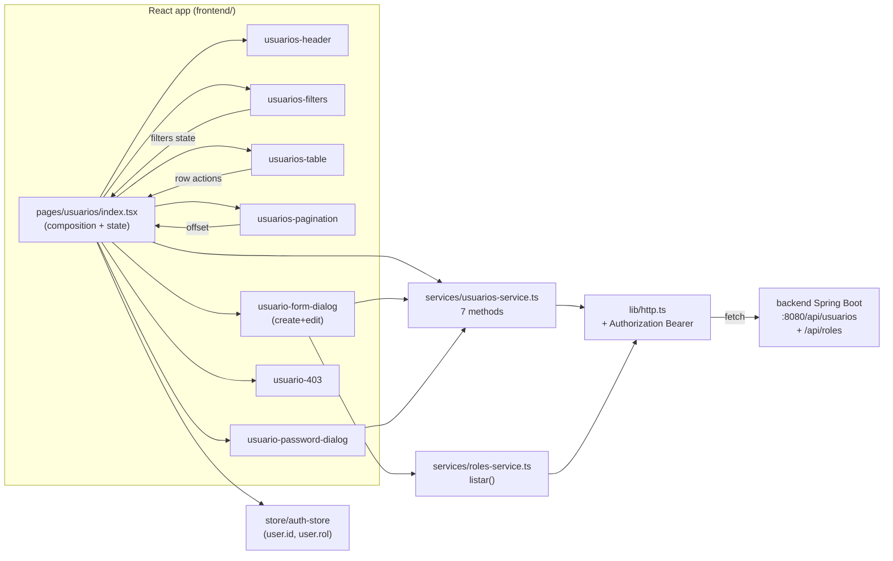

# Design: Admin user-management page

**Change**: `users-admin-page`
**Capability**: `usuarios`
**Scope**: Frontend only. Backend `UsuarioController` (94 LOC) + `RolController` (5 endpoints) and Postman collection stay untouched.

## 1. Architecture overview



### Data flow per interaction

| Interaction | Trigger | Path | Notes |
|---|---|---|---|
| **Initial load** | `/usuarios` mount | `index` → `usuariosService.listar({limit:20,offset:0}, signal)` | `AbortController` aborts previous in-flight request on every change |
| **Filter (texto/rol/activo)** | `usuarios-filters` debounced 300ms | `setFilters` → `useEffect` re-fires `listar` | Resets `offset` to 0 |
| **Pagination (Prev/Next)** | `usuarios-pagination` button | `setOffset` → `useEffect` re-fires `listar` | `Next` disabled when `!hasMore`; `Prev` disabled when `offset === 0` |
| **Create** | `usuario-form-dialog` submit (mode=`create`) | `usuariosService.crear(input)` → refetch list → close dialog → success Alert | 400 inline `FieldError` on email/password fields |
| **Edit** | `usuario-form-dialog` mount with `usuario` → submit | `obtener(id)` to prefill → `actualizar(id, input)` → refetch → close → success Alert | Edit dialog MUST NOT include password field (per spec REQ-4) |
| **Change password** | `usuario-password-dialog` submit | `cambiarPassword(id, {password})` → 204 → close → success Alert | Client-side min-length 6 check before request |
| **Toggle active** | row icon click | optimistic flip in row state → `activar(id)` or `desactivar(id)` → on error revert + error Alert | Self-row toggle is rendered disabled with `title` attribute (no Tooltip primitive installed) |
| **403 (non-admin)** | `listar` rejects with `ApiError status=403` | `index` catches, sets `forbidden=true`, renders `usuario-403` | Sidebar remains visible to all (no flicker) |

## 2. File layout

```
NEW FILES
frontend/src/pages/usuarios/index.tsx                  (~110 lines) composition, state, dialog orchestration
frontend/src/pages/usuarios/types.ts                    (~20 lines)  PageCursor, FilterState, DialogState
frontend/src/pages/usuarios/components/usuarios-header.tsx           (~50 lines)  title + counter + Nuevo Usuario CTA
frontend/src/pages/usuarios/components/usuarios-filters.tsx          (~95 lines)  search debounce + rol select + activo switch + clear
frontend/src/pages/usuarios/components/usuarios-table.tsx            (~150 lines) table rows + actions + self-guard
frontend/src/pages/usuarios/components/usuarios-pagination.tsx        (~70 lines)  Prev/Next + counter + disabled
frontend/src/pages/usuarios/components/usuario-form-dialog.tsx       (~230 lines) create + edit (mode prop)
frontend/src/pages/usuarios/components/usuario-password-dialog.tsx   (~110 lines) reset password + confirm
frontend/src/pages/usuarios/components/usuario-403.tsx                (~30 lines)  in-page 403 state
frontend/src/services/roles-service.ts                  (~25 lines)  listar + obtener (future-proof)
frontend/src/types/roles.ts                             (~15 lines)  Rol interface

MODIFIED FILES
frontend/src/services/usuarios-service.ts               (1 → 7 methods, ~85 lines added)
frontend/src/types/usuarios.ts                          (move Rol out, add 4 inputs, keep Usuario; ~30 lines net)
frontend/src/router.tsx                                 (+1 route, ~10 lines)
frontend/src/layout/app-sidebar.tsx                     (+1 prop, ~1 line)
```

Total: ~960 lines added, ~13 modified. Forecast grew from 600–900 (proposal) to ~960 after concrete contract resolution (debounce hook, dialog internal state, lucide icon roster).

## 3. Component contracts

### `pages/usuarios/index.tsx`

```ts
// Internal state only (no Zustand)
const [filters, setFilters] = useState<FilterState>({ texto: "", rol: "", activo: null })
const [cursor, setCursor] = useState<PageCursor>({ offset: 0, limit: 20, hasMore: true })
const [usuarios, setUsuarios] = useState<Usuario[]>([])
const [isLoading, setIsLoading] = useState(false)
const [forbidden, setForbidden] = useState(false)
const [globalError, setGlobalError] = useState<string | null>(null)
const [successMessage, setSuccessMessage] = useState<string | null>(null)
const [dialogState, setDialogState] = useState<DialogState>({ kind: "closed" })
const [togglingId, setTogglingId] = useState<string | null>(null)

type DialogState =
  | { kind: "closed" }
  | { kind: "create" }
  | { kind: "edit"; usuario: Usuario }
  | { kind: "password"; usuario: Usuario }
```

**Effects**: `useEffect` watches `[filters, cursor]` → fires `listar` with a fresh `AbortController`, aborts the previous signal on re-run. Race-free on rapid filter typing.

**Cleanup**: `useEffect` returns `() => controller.abort()` on unmount.

### `components/usuarios-header.tsx`

```ts
interface Props {
  totalShown: number;     // usuarios.length (live)
  onNew: () => void;
}
```

Renders `<h1>`, subtitle, and `<Button>` with `<Plus>` icon. No internal state. Counter line: `Mostrando {cursor.offset + 1}–{cursor.offset + totalShown}`. When list is empty, displays `"Sin resultados"`.

### `components/usuarios-filters.tsx`

```ts
interface Props {
  value: FilterState;
  roles: Rol[];              // pre-loaded by index
  rolesError: string | null;
  onChange: (next: FilterState) => void;
  onClear: () => void;
}
```

Internal state: `const [draft, setDraft] = useState(value)`. Effect debounces `draft.texto` by 300ms before calling `onChange`. Rol `<select>` is native (validated by `pages/categorias/index.tsx:237`). Activo switch is native `<input type="checkbox">` inside a `Field orientation="horizontal"` (already supported by `field.tsx`).

### `components/usuarios-table.tsx`

```ts
interface Props {
  usuarios: Usuario[];
  loading: boolean;
  currentUserId: string;
  togglingId: string | null;
  onEdit: (u: Usuario) => void;
  onChangePassword: (u: Usuario) => void;
  onToggleActive: (u: Usuario) => void;
}
```

Each row: `Avatar`+`AvatarFallback` with initials, `nombre`, `email`, `Badge` with `rol.nombre`, `—` for Cliente cell, custom dot+label for Estado, action cell with `Pencil` / `KeyRound` (with `Lock` fallback) / `Power` or `PowerOff`. Self-row: toggle button `disabled` + `title="No puedes desactivar tu propio usuario administrador"`.

### `components/usuarios-pagination.tsx`

```ts
interface Props {
  cursor: PageCursor;
  totalShown: number;
  onPrev: () => void;
  onNext: () => void;
}
```

Counter reads from `cursor.offset + 1` to `cursor.offset + totalShown` — no total claim. Buttons use `ChevronLeft` / `ChevronRight`.

### `components/usuario-form-dialog.tsx`

```ts
interface Props {
  mode: "create" | "edit";
  usuario: Usuario | null;        // non-null when mode="edit"
  roles: Rol[];
  rolesError: string | null;
  isSubmitting: boolean;
  globalError: string | null;
  fieldErrors: Record<string, string | null>;  // { email, password, general }
  onSubmit: (values: FormValues) => Promise<void>;
  onCancel: () => void;
}
```

Internal state for each field, plus a `useEffect` to reset state when `usuario` changes (edit-mode prefill). Submit handler performs client-side validation (non-empty, email pattern, password min 6 only in create), then calls `onSubmit`. Renders `Field`/`FieldLabel`/`Input`/`FieldError` per login-form pattern.

### `components/usuario-password-dialog.tsx`

```ts
interface Props {
  usuario: Usuario;
  isSubmitting: boolean;
  globalError: string | null;
  fieldError: string | null;
  onSubmit: (values: { password: string }) => Promise<void>;
  onCancel: () => void;
}
```

Two `Field`s: password + confirm. Client-side match check before calling `onSubmit`. Reads user label from `usuario.nombre` for dialog title.

### `components/usuario-403.tsx`

Renders an `Alert variant="destructive"` with `AlertTriangle` icon + title "Acceso denegado" + description "No tienes permisos para acceder a esta sección." plus a link to `/dashboard`. Pure presentational.

### `services/roles-service.ts`

```ts
import { apiRequest } from "@/lib/http"
import type { Rol } from "@/types/roles"

export const rolesService = {
  listar(signal?: AbortSignal): Promise<Rol[]> {
    return apiRequest<Rol[]>("/api/roles", { method: "GET", signal })
  },
  obtener(id: string, signal?: AbortSignal): Promise<Rol> {
    return apiRequest<Rol>(`/api/roles/${id}`, { method: "GET", signal })
  },
}
```

Note: `obtener` is included for completeness even though v1 only consumes `listar`. The skill states "no unused exports"; `obtener` is dead code today → **drop it** and keep `listar` only (~10 lines).

## 4. State management strategy

- **Page-local only** (`useState` / `useEffect` in `index.tsx`). Mirrors `pages/clientes/index.tsx` and `pages/categorias/index.tsx`.
- **No Zustand store** — confirmed not needed; no cross-page consumer.
- **Server state = fetched fresh on every filter/pagination change**. No SWR / React Query (not in stack — verified via `package.json`).
- **Race-free on rapid typing** via `AbortController` per fetch (signal passed to `apiRequest` → see Risk #1 for `http.ts` gap).

## 5. Service contracts

### `services/usuarios-service.ts`

```ts
import { apiRequest } from "@/lib/http"
import type { Usuario, CrearUsuarioInput, ActualizarUsuarioInput, CambiarPasswordInput } from "@/types/usuarios"

export interface ListarUsuariosParams {
  texto?: string
  rol?: string           // codigo (e.g. "ADMINISTRADOR")
  activo?: boolean       // undefined = all
  limit: number          // [5,100], default 20
  offset: number         // >= 0
}

export const usuariosService = {
  listar(params: ListarUsuariosParams, signal?: AbortSignal): Promise<Usuario[]> {
    const search = new URLSearchParams()
    if (params.texto) search.set("texto", params.texto)
    if (params.rol) search.set("rol", params.rol)
    if (params.activo !== undefined) search.set("activo", String(params.activo))
    search.set("limit", String(params.limit))
    search.set("offset", String(params.offset))
    const qs = search.toString()
    return apiRequest<Usuario[]>(`/api/usuarios${qs ? `?${qs}` : ""}`, { method: "GET", signal })
  },
  obtener(id: string, signal?: AbortSignal): Promise<Usuario> {
    return apiRequest<Usuario>(`/api/usuarios/${id}`, { method: "GET", signal })
  },
  crear(input: CrearUsuarioInput): Promise<Usuario> {
    return apiRequest<Usuario>("/api/usuarios", { method: "POST", body: JSON.stringify(input) })
  },
  actualizar(id: string, input: ActualizarUsuarioInput): Promise<Usuario> {
    return apiRequest<Usuario>(`/api/usuarios/${id}`, { method: "PUT", body: JSON.stringify(input) })
  },
  cambiarPassword(id: string, input: CambiarPasswordInput): Promise<void> {
    return apiRequest<void>(`/api/usuarios/${id}/password`, { method: "PATCH", body: JSON.stringify(input) })
  },
  activar(id: string): Promise<Usuario> {
    return apiRequest<Usuario>(`/api/usuarios/${id}/activar`, { method: "PATCH" })
  },
  desactivar(id: string): Promise<Usuario> {
    return apiRequest<Usuario>(`/api/usuarios/${id}/desactivar`, { method: "PATCH" })
  },
}
```

## 6. Types

### `types/usuarios.ts` (after change)

```ts
import type { Rol } from "@/types/roles"
export type { Rol }

export type Usuario = {
  id: string
  nombre: string
  email: string
  rol: Rol
  activo: boolean
  avatarUrl?: string | null
  creadoEn?: string      // ISO; backend LocalDateTime serializes as ISO
  actualizadoEn?: string
}

export type CrearUsuarioInput = {
  nombre: string                      // backend @NotBlank @Size(max=150)
  email: string                       // @NotBlank @Email @Size(max=150)
  password: string                    // @NotBlank @Size(min=6,max=100)
  rolCodigo: "ADMINISTRADOR" | "AGENTE" | "USUARIO"   // matches seed roles
  avatarUrl?: string                  // @Pattern https URL, optional
  activo?: boolean                    // defaults true server-side
}

export type ActualizarUsuarioInput = {
  nombre: string
  email: string
  rolCodigo: "ADMINISTRADOR" | "AGENTE" | "USUARIO"
  avatarUrl?: string
  activo: boolean
}

export type CambiarPasswordInput = {
  password: string                    // @NotBlank @Size(min=6,max=100); confirm is client-only
}
```

### `types/roles.ts` (new)

```ts
export type Rol = {
  id: string                          // UUID serialized as string by Spring
  codigo: string                      // "ADMINISTRADOR" | "AGENTE" | "USUARIO"
  nombre: string                      // "Administrador" etc.
  descripcion?: string
  activo: boolean
}
```

Re-export `Rol` from `types/usuarios.ts` to avoid breaking any existing import site.

## 7. Backend DTO alignment

| Frontend type | Backend file:line | Field-by-field check |
|---|---|---|
| `Usuario` | `usuarios/dto/UsuarioResponse.java:10-20` | `id:UUID` → `string` ✓ · `nombre:String` ✓ · `email:String` ✓ · `rol:RolResponse` ✓ · `activo:Boolean` ✓ · `avatarUrl:String` ✓ · `creadoEn:LocalDateTime` → `string` ✓ · `actualizadoEn:LocalDateTime` → `string` ✓ |
| `Rol` | `usuarios/dto/RolResponse.java:10-16` | `id:UUID` → `string` ✓ · `codigo:String` ✓ · `nombre:String` ✓ · `descripcion:String` (frontend optional) ✓ · `activo:Boolean` ✓ |
| `CrearUsuarioInput` | `usuarios/dto/CrearUsuarioRequest.java:12-36` | All 6 fields match. Backend `activo` defaults to `true`; frontend may omit |
| `ActualizarUsuarioInput` | `usuarios/dto/ActualizarUsuarioRequest.java:11-32` | 5 fields, no `password` (matches spec REQ-4) |
| `CambiarPasswordInput` | `usuarios/dto/CambiarPasswordRequest.java:10-14` | Single `password` field. `confirmacion` is client-only — NOT sent |

**Naming**: Spring serializes by Java field name (camelCase) via Jackson defaults; no `@JsonProperty` overrides are present in any of these DTOs. Frontend camelCase matches verbatim.

**No invented fields**: per spec REQ-11, do NOT add `cliente`, `aplicativoId`, or `total` to `Usuario`. The "Cliente" column renders literal `"—"` (matches `pages/categorias/index.tsx:330` precedent for missing data).

## 8. Error handling

| Error source | Surface |
|---|---|
| `ApiError.status === 403` on initial list | Render `<usuario-403>` instead of table; sidebar stays visible |
| `ApiError.status >= 500` on list | `<Alert variant="destructive">` banner above filters; keep previous table rows visible |
| `ApiError.status === 400` on create/edit | Map to `fieldErrors[email]` if message contains "email"; else `fieldErrors[password]` if message contains "password"; else `globalError` |
| `ApiError.status === 400` on toggle (self-deactivation bypass) | Revert optimistic state + `<Alert variant="destructive">` with the message |
| Roles endpoint failure | `rolesError` prop disables the `<select>` + inline `FieldError` "No se pudieron cargar los roles"; dialog still opens |

**Gap to close**: `http.ts` does not currently forward `signal` to `fetch`. To make `AbortController` actually cancel in-flight requests, `src/lib/http.ts` must spread `options.signal` into the `fetch` call (lines 25-32). This is a 1-line change to a SHARED file — see Risks #1 and follow-up flag.

`ApiError.message` comes from `payload.mensaje ?? payload.message` per existing `http.ts:40-45` — already aligned with backend `GlobalExceptionHandler` (`{fecha,estado,error,mensaje,ruta,detalles[]}`).

## 9. Pagination algorithm

- `PageCursor = { offset: number, limit: number, hasMore: boolean }`.
- Initial: `{ offset: 0, limit: 20, hasMore: true }`.
- After every `listar`: `setCursor({ offset, limit, hasMore: items.length === limit })`.
- `Prev`: `setCursor({ offset: Math.max(0, c.offset - c.limit), ... })`.
- `Next`: `setCursor({ offset: c.offset + c.limit, ... })`.
- Counter line: `Mostrando {offset + 1}–{offset + items.length}`. When `items.length === 0`, render `"Sin resultados"`.
- Limit clamped client-side to `[5, 100]` (backend also clamps, but frontend hint prevents silly requests). v1 uses fixed `limit = 20` (no UI selector).
- Filter changes reset `offset = 0` and `hasMore = true`.

**Honest copy**: never claim "de X a Y de Z total" — backend returns no `total`. Counter is "Mostrando A–B", no total.

## 10. Accessibility

| Element | Attribute |
|---|---|
| All dialogs | `Dialog.Title` + `Dialog.Description` always present (mandatory for `DialogContent`) |
| Form fields | shadcn `Field` + `FieldLabel` (with `htmlFor`) + `FieldError` per login-form pattern |
| Toggle button (row) | `aria-label="Activar/Desactivar a {nombre}"`; self-row gets `title="No puedes desactivar tu propio usuario administrador"` (no Tooltip primitive — verified, none installed) |
| Filter inputs | `aria-label` on the native `<select>` (Rol) and the search `<input>`; switch uses associated `<label>` |
| Pagination buttons | `aria-label="Página anterior"` / `"Página siguiente"`; `aria-disabled` mirrors `disabled` |
| Table | Semantic `<Table>`, `<TableHeader>`, `<TableBody>`, `<TableRow>`, `<TableCell>` via shadcn (already verified in `pages/categorias/index.tsx:284`) |

## 11. Testing & verification

Per `frontend/AGENTS.md`: no automated test runner. Verification = `npm run lint && npm run build` + manual smoke at `http://127.0.0.1:5173/`.

### Static checks

1. `npm run lint` — must pass with zero errors.
2. `npm run build` — must pass with zero errors (also catches missing lucide-react exports).

### Manual smoke checklist (covers spec REQ-12)

1. Login as admin → click sidebar **Usuarios** → list renders with `Mostrando 1–N`.
2. Type in search → after ~300ms list re-fetches; offset resets to 0.
3. Select a rol → list re-fetches; rol filter pill visible.
4. Toggle "Solo inactivos" → list narrows to inactive users.
5. Click **Limpiar** → all filters reset; full list returns.
6. Click **Nuevo Usuario** → form dialog opens with rol dropdown populated.
7. Fill form (nombre, email, password, rol, activo=true) → submit → dialog closes → success banner → new row at top.
8. Repeat with duplicate email → dialog stays open, inline error on email field.
9. Repeat with 5-char password → dialog stays open, inline error on password field.
10. Click edit icon → prefilled dialog (no password field) → modify → submit → row updates.
11. Click key icon → password dialog → enter + confirm → submit → success.
12. Click toggle on an active non-self row → row flips inactive; on a network error, row reverts + error banner.
13. Locate own row → toggle is disabled with tooltip text on hover.
14. Click **Siguiente** → list advances; **Anterior** disabled at first page.
15. **Siguiente** disabled when fewer items than `limit` returned.
16. Empty filter result → "No se encontraron usuarios con los filtros aplicados."
17. Unfiltered empty backend → "Aún no hay usuarios registrados."
18. Login as **AGENTE** / **USUARIO** → sidebar **Usuarios** still visible → click → page shows in-page 403 message (no redirect).
19. Direct URL `/usuarios` as non-admin → same 403 state.

## 12. Implementation order

1. Types — `types/roles.ts` (new), `types/usuarios.ts` (move Rol out + add inputs).
2. Patch `lib/http.ts` — forward `signal` to `fetch` (1-line, unblocks AbortController).
3. `services/roles-service.ts` (new, `listar` only).
4. `services/usuarios-service.ts` (extend to 7 methods + `URLSearchParams` builder).
5. `pages/usuarios/types.ts` (page-local `FilterState`, `PageCursor`, `DialogState`).
6. `pages/usuarios/components/usuarios-header.tsx`.
7. `pages/usuarios/components/usuarios-filters.tsx` (debounce hook).
8. `pages/usuarios/components/usuarios-table.tsx`.
9. `pages/usuarios/components/usuarios-pagination.tsx`.
10. `pages/usuarios/components/usuario-form-dialog.tsx` (mode=`create` then mode=`edit`).
11. `pages/usuarios/components/usuario-password-dialog.tsx`.
12. `pages/usuarios/components/usuario-403.tsx`.
13. `pages/usuarios/index.tsx` (compose, wire state + effects + dialog orchestration).
14. `router.tsx` (+1 route).
15. `app-sidebar.tsx` (+1 prop).
16. `npm run lint && npm run build` then manual smoke walkthrough.

**Work-unit slicing hint for `sdd-tasks`** (forecast ~960 LOC, 400-line review budget at HIGH risk):

| Slice | Files | Approx LOC |
|---|---|---|
| **A — Foundation** | `types/roles.ts`, `types/usuarios.ts`, `lib/http.ts` (signal forward), `services/roles-service.ts`, `services/usuarios-service.ts` | ~200 |
| **B — Page + table** | `pages/usuarios/{types,index}.tsx`, `components/{usuarios-header,usuarios-filters,usuarios-table,usuarios-pagination}.tsx` | ~510 |
| **C — Dialogs** | `components/{usuario-form-dialog,usuario-password-dialog,usuario-403}.tsx` | ~370 |
| **D — Wiring** | `router.tsx`, `app-sidebar.tsx` | ~12 |

Each slice is independently lint+build clean. Recommend chained PRs A → B → C → D unless orchestrator accepts `size:exception`.

## Open questions

None blocking. Decision-needed items flagged below as risks.

## Risks

1. **`http.ts` does not forward `AbortSignal`** — current `apiRequest` (lines 18-32) does not spread `options.signal` into the `fetch` call. Adding `signal` to the signature is a 1-line, cross-cutting change. Without it, the debounced filter still races (last-typed request wins by order, not by cancellation). Mitigation: include the signal patch in **Slice A** so it lands first.
2. **No toast library installed** (`grep` for `sonner|useToast|react-hot-toast` → 0 matches; `package.json` no deps). The spec says "success toast" / "error toast"; the honest implementation is an inline `Alert` (destructive for errors, default for success) at the top of the page, auto-dismissed via `setTimeout(3000)` for success. Document the divergence from spec wording.
3. **No Tooltip primitive installed** — self-row toggle uses native `title` attribute. Acceptable for v1; flag as a follow-up if richer UX is needed.
4. **`lucide-react@1.17.0` icon drift** — `KeyRound` and `Lock` flagged by spec for verification. Fallback chain in code: `KeyRound` → `Lock` → `Pencil` (edit icon reused). Each icon import verified at build time during Slice C.
5. **Forecast exceeds 400-line review budget** — ~960 LOC. Recommend chained PRs per Slice A/B/C/D. Orchestrator decision at tasks phase.
6. **`UsuarioResponse.creadoEn` / `actualizadoEn` are nullable** — Jackson may omit them entirely; TS already marks them optional. No runtime guard needed but `Date` parsing not used in v1 (timestamps shown only on future profile page).
7. **Backend may emit `Boolean activo` as literal `true`/`false` vs absent** — `activo` is non-null in DTO (`Boolean`, not `boolean`) but Lombok `@Builder` defaults to `null` when unset. Service layer is responsible for setting it; SQL `activo` column is `NOT NULL` with default `true`. Safe at runtime; frontend types remain `boolean` (not `boolean | null`) based on observed response.
8. **Sidebar admin gating is cosmetic** — backend 403 is the source of truth. If a future change adds a server-sent `esAdministrador` flag, the page could short-circuit the initial fetch; out of scope for this change.
9. **`AuthUser.rol` is a string** (not the `Rol` object) — self-deactivation check uses `currentUser.id === usuario.id && currentUser.rol === "ADMINISTRADOR"`. Matches spec REQ-6 self-toggle scenario.

## Threat matrix

N/A — no routing, shell, subprocess, VCS/PR automation, executable-file classification, or process-integration boundary in this change. `lib/http.ts` does route through `fetch`, but that is local-browser HTTP, not the boundary this matrix covers.

## Migration / Rollout

No migration required. Pure feature addition behind an existing private route.

## Acceptance criteria

- All 12 functional + 6 non-functional scenarios from `specs/usuarios/spec.md` pass manual smoke.
- `npm run lint` zero errors.
- `npm run build` zero errors.
- Sidebar **Usuarios** link is live for all logged-in users; non-admins land on the in-page 403 state.

## Next step

`sdd-tasks` — break Slices A/B/C/D into executable tasks, confirm chained-PR vs `size:exception` decision with the user.